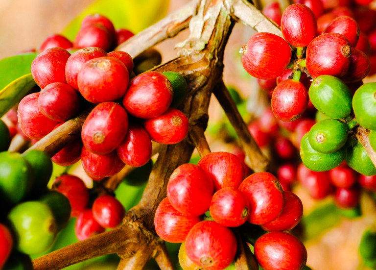
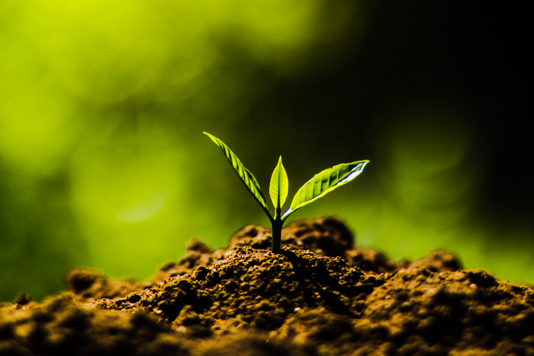
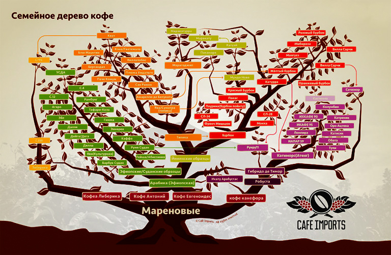

# Разновидности кофе. Часть 1

Часть 1 · [Часть 2](../010-ru-varieties-of-coffee-pt2/)

Кофе делят на виды: арабику, робусту, либерику и ещё несколько редких. По легенде первый кофе нашли между Эфиопией, Суданом и Кенией — это была арабика. Позже выяснилось, что арабика появилась, когда скрестились робуста и эужениоидис — редкий и малоурожайный вид.

Но на этом различия не закончились. Арабика продолжала скрещиваться и мутировать. Так появились сотни разновидностей. Расскажу о самых важных.

*Кофейная ягода*

## Как появляются разновидности

Разновидности, которые иногда называют сортами, появляются тремя путями: естественное скрещивание, естественная мутация и селекция.

1. **Естественное скрещивание** — одно дерево опыляет другое, и получается новая разновидность. Результат случайный и далеко не всегда удачный.
2. **Естественная мутация** может случиться, когда дерево пересаживают в другой регион. Другая почва и климат меняют внешний вид, урожайность и вкус.
3. **Селекция** — искусственное скрещивание двух разновидностей, чтобы получить третью. Фермеры обычно сажают уже проверенные деревья: селекция дорогая, долгая и непредсказуемая.

Самые известные селекционные разновидности — SL-28 и SL-34. Их получили в 1930-х в Scott Laboratories, отсюда и название. Во вкусе — цитрусовая кислотность и сладость в послевкусии. Их часто считают почти элитными.

*Саженец разновидности SL-28*

## Самые популярные разновидности

Большая часть арабики в мире идёт от типики — той самой разновидности, которую нашли в Эфиопии.

Типика на вкус чистая и сладкая, с полным телом. Качество высокое, урожайность низкая. Первая зафиксированная мутация типики дала бурбон. Урожайность у него выше, но он хуже сопротивляется [болезням](../008-ru-coffee-tree-diseases/). Во вкусе — сложная кислотность, фрукты и карамельная сладость.

Типика и бурбон стали родителями почти всех известных разновидностей. Исключение — дикие деревья из того же региона между Эфиопией, Суданом и Кенией: гейша, руме судан, дуддука, сеосиас, иргалем и другие. Они стоят в одном ряду с типикой и часто хорошо проявляются во вкусе.

Из потомков типики и бурбона чаще всего встречаются мундо ново, пакас и катурра:

1. **Мундо ново** хорошо противостоит болезням, но капризен к почве. Вкус лёгкий, слегка горьковатый, без сладости.
2. **Пакас** урожайнее бурбона и любит высоту. Среднее тело, сбалансированная кислотность и сладость, цветочные и пряные ноты.
3. **Катурра** растёт в Бразилии, Колумбии и Центральной Америке. На большой высоте зерно лучше, но урожая меньше. Лёгкое тело и яркая лимонная кислотность.

Особняком стоит марагоджип — естественная мутация типики из Бразилии. Он растёт высоко и даёт самые крупные листья и зёрна. Урожайность низкая. Вкус плотный, с цветочно-цитрусовыми нотами.

## Другие разновидности

Потомки типики и бурбона продолжают скрещиваться. Так появляются разновидности третьего и следующих уровней. Перечислить все нельзя: их как минимум 500, а точное число неизвестно.

*Семейное дерево разновидностей кофе*

Из таких чаще всего встречаются:

1. **Катимор** — гибрид катурры и гибридо-де-тимор. Выведен в Бразилии, урожайный и устойчивый к болезням. Из-за робусты в родословной вкус обычно простой. При хорошей обработке можно почувствовать травы и фрукты.
2. **Маракату** — гибрид марагоджипа и катурры. Растёт на возвышенностях Центральной Америки. Среднее тело, яркая кислотность и спелые фрукты.

У одной разновидности ещё бывают свои вариации. Например, красная и жёлтая типика — и такой же бурбон. Главное отличие — цвет ягод. О разнице во вкусе единого мнения нет.

## Какая разновидность самая лучшая

Ответа нет. У всей арабики примерно одинаковое содержание кофеина, так что «более бодрящей» разновидности не бывает. Для тех, кто пьёт кофе, а не выращивает его, главное — вкус.

А генетика ещё и [не единственный фактор вкуса](../007-ru-influence-of-climate-on-the-taste-of-coffee/). Так что выбирать «лучшую» разновидность бессмысленно. Каждый решает сам.
