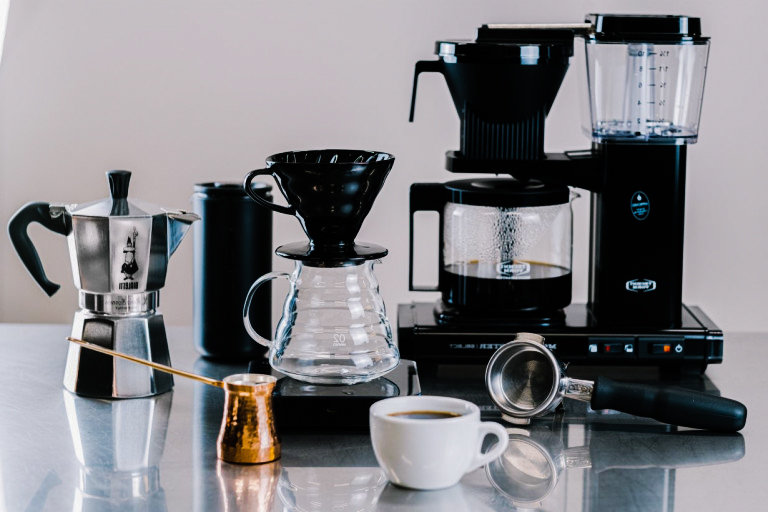
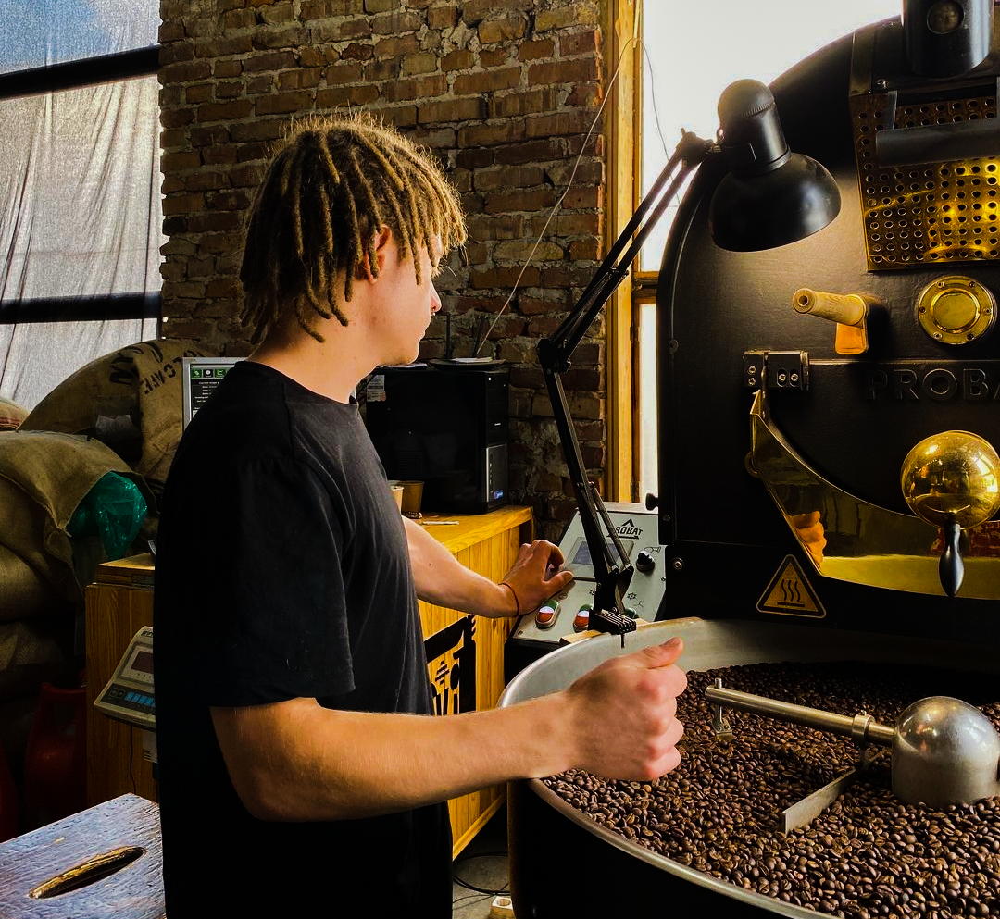
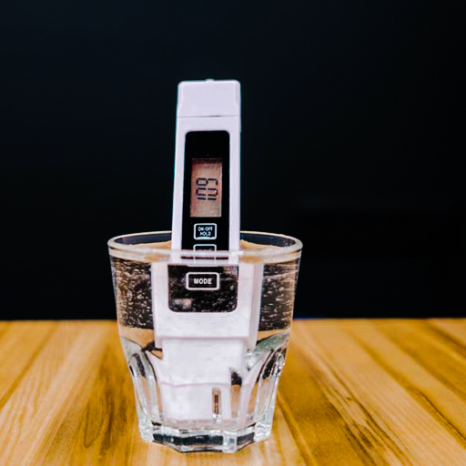

# Общие рекомендации по приготовлению кофе

Прежде чем готовить кофе, стоит понять, что сильнее всего влияет на вкус. Это помогает с любым методом и с экспериментами. Таких факторов шесть:

1. свежесть зерна;
2. качество воды;
3. хранение;
4. помол;
5. чистота оборудования;
6. точность весов.

## Свежесть

*Свежеобжаренное зерно*

Для вкусной чашки зерно должно быть свежо обжарено.

При обжарке белки и сахара реагируют друг с другом — так появляются вещества, из которых складываются вкус и аромат. После обжарки букет ещё какое-то время собирается. Примерно через две недели качество начинает падать: кофе выдыхается.

Через два месяца вкус становится ровнее и слабее, иногда прогорклым, как старое масло. Аромат страны и региона теряется.

Ориентир простой: первые два месяца после обжарки зерно ещё можно считать свежим.

Есть нюанс с эспрессо. Для фильтра зерно можно пробовать уже через день после обжарки. Для эспрессо лучше дать ему отдохнуть минимум пять дней — тогда потенциал раскрывается лучше.

## Вода

Кофе почти на 99% состоит из воды, поэтому [она должна подходить](../020-ru-water/).

В воде не только H₂O, но и соли с минералами. Их количество называют минерализацией. Если минералов мало, кофе получается резким и горьким. Если много — плоским, с бумажными нотами.

После простого фильтра у водопровода часто около 300 мг/л — это много. SCA рекомендует 75–175 мг/л, а удобная цель — около 100 мг/л. pH лучше держать в диапазоне 6,5–8.

Как к этому прийти:

1. прогнать воду через осмос и получить почти дистиллированную;
2. затем подмешать минерализованную воду или поставить реминерализующий картридж.

Домашней сложной системе есть альтернатива — бутилированная вода.

Умягчители воду «не делают лучше для вкуса». Они меняют кальций на натрий: накипи меньше, а минерализация та же. Натрий вкусу кофе вредит.
