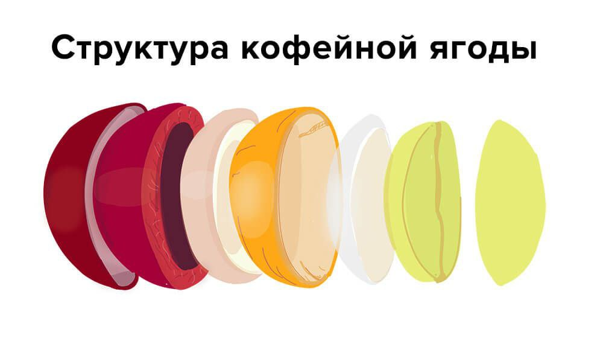

# Методы обработки кофейных зёрен

Сбор урожая сильно влияет на качество будущего кофе. Способов несколько:

1. **Ручной сбор, или пикинг.** Берут только спелые ягоды. Незрелые оставляют на дереве.
2. **Ручной стриппинг.** Срывают с ветки всё сразу — и спелое, и нет. Ягоды падают на брезент или в корзину.
3. **Механический сбор.** Специальные устройства обрывают ягоды. Удобно на больших плантациях.
4. **Машинный стриппинг.** Машины снимают урожай целиком, когда нужно собрать много и быстро.

Метод зависит от страны. В Бразилии, например, часто собирают механически.

## Зачем знать про обработку

Разные способы по-разному меняют вкус. Но обработка — не всё. Ещё влияют терруар, разновидность, обжарка, помол и вода.

Сначала обработка была просто способом достать зерно из ягоды. Брали то, что подходит климату, и о вкусе почти не думали. Потом стало ясно: при прочих равных мытый кофе получается кислотнее натурального.

## Структура ягоды

У ягоды шесть слоёв: кожица, мякоть, клейковина, пергаментная оболочка (пачмент), серебристая кожица (сильверскин) и само зерно. Они защищают от солнца и повреждений и дают питание. При обработке работают с первыми четырьмя слоями.

От того, сколько слоёв оставляют на сушке, зависят четыре базовых метода:

- сушка в ягоде — **натуральный**;
- сушка в клейковине — **хани / полумытый**;
- сушка в пачменте — **мытый**;
- сушка зерна — **вет-хани**.

Чаще всего метод выбирают по погоде, цене и наличию воды.

## Натуральный метод

Классика. Так кофе обрабатывали с самого начала.

В Эфиопии и Йемене сухой климат, без долгих дождей, поэтому ягода хорошо сохнет на воздухе. Её кладут на патио или африканские кровати — сетку над землёй. Обычно это занимает около четырёх недель. На некоторых фермах после нескольких дней на солнце ягоды досушивают в машинах.

Ягода сохнет вместе с зерном, сахара из мякоти и клейковины остаются внутри. Поэтому натуральный кофе обычно плотнее и слаще мытого.

Сейчас этот способ снова любят: спешелти гоняется за ярким вкусом, а натуралка часто даёт высокие оценки в каппинге. Сушку заканчивают, когда в зерне около 12% влаги. Затем ягоды ещё лежат в силосах, чтобы стабилизировать вкус. Потом халлинг — шелуху снимают, зелёное зерно упаковывают на экспорт.

Плюсы: яркий вкус, в сухом климате метод дешевле, нет сточных вод.

Минусы: перед сушкой нужно убрать незрелые ягоды, во время сушки часто ворошить, иначе начнётся гниение. Во влажном климате способ плохо работает.

## Мытый метод

Мякоть снимают ферментацией, затем смывают водой. Метод появился, когда европейцы посадили кофе в Индонезии, на Кубе и в Центральной Америке. Во влажном климате ягоды гнили, а спрос рос — нужен был более быстрый способ. В 1850-х британцы на Ямайке придумали мытую обработку.

Как это выглядит:

1. депульпация — снимают кожицу;
2. ферментация — в танках бактерии и дрожжи разрушают мякоть и клейковину на пачменте;
3. остатки смывают водой и сушат.

Мытый кофе обычно чище и кислотнее. Пачмент тоже отлёживается, затем идёт на халлинг и в экспортную упаковку.

Плюсы: сушка быстрее, меньше площади, более чистый вкус.

Минус: много сточных вод.

## Хани и полумытый

Оба способа — сушка в клейковине, но они разные.

**Хани:** снимают кожицу и часть мякоти. При сушке зерно становится липким и медового цвета — отсюда honey, «мёд». После депульпации кофе сушат до 10–12% влаги.

**Полумытый:** после депульпации зерно идёт в демюсилятор. Машина снимает мякоть почти полностью, и сушка идёт ещё быстрее.

На выходе — пачмент. Его тоже держат в силосах, затем халлят и упаковывают.

Плюсы: быстрее натуралки, больше вариаций вкуса, меньше отходов. Оставшуюся мякоть можно вернуть в почву как удобрение.

Минусы: выше риск механических дефектов, нужно дорогое оборудование.

## Вет-хани

С ягоды снимают кожицу, мякоть и пачмент. Сначала как при мытом: очистка, ферментация в воде. Главное отличие — зерно сушат только до 20–24% влаги, а не до 10–12%. Затем ещё влажное зерно отправляют на халлинг и досушивают уже без пачмента.

Это самый быстрый способ. Минусы серьёзные: много дефектов и зерно быстрее стареет при хранении.
