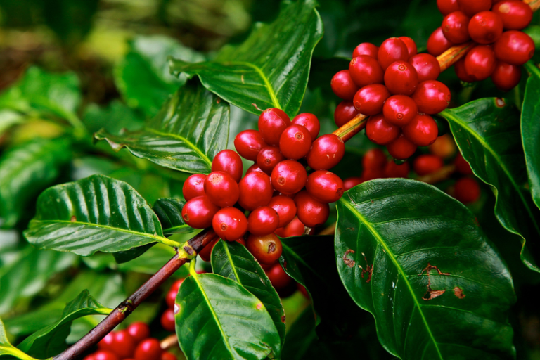
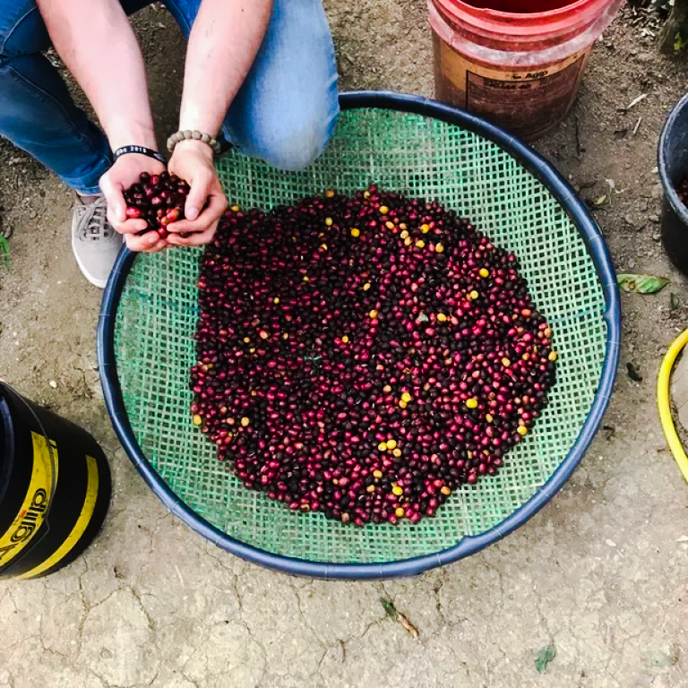
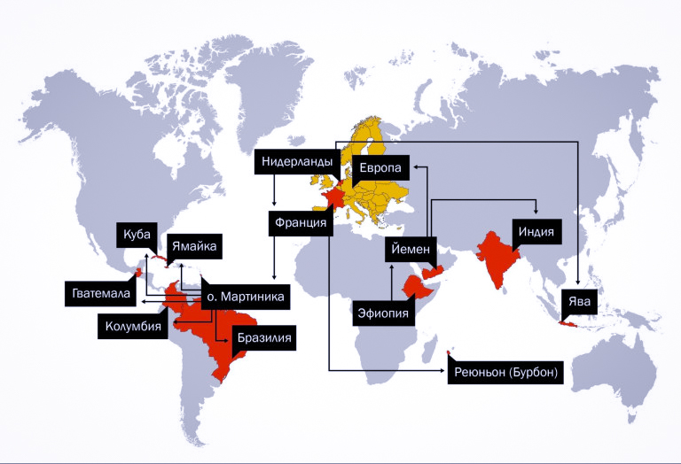
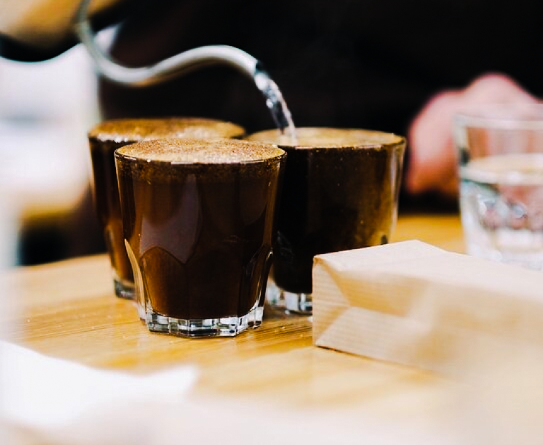

# История распространения кофе

Кофе как напиток появился больше тысячи лет назад в Эфиопии. Если бы не один предприимчивый пилигрим и смекалистые голландцы, он мог бы до нас и не добраться. Цепочка случайностей дала больше 500 разновидностей арабики и разнесла кофе по миру.

## Как кофе вывезли из Йемена, а на Бурбоне нашли бурбон

Родина кофе — Эфиопия. Первые деревья арабики нашли в тропических лесах региона Каффа.

Есть легенда о пастухе Калди. Он заметил, что козы едят листья и красные ягоды и становятся слишком резвыми. Попробовал сам — почувствовал прилив сил. Затем отнёс плоды монахам из соседнего монастыря.

Около тысячи лет назад семена арабики вывезли из Каффы в район Харрар. Эту разновидность назвали типикой.

*Ягоды типики: алые, продолговатые*

Типика — первая известная разновидность арабики. Она растёт по всему миру, особенно в Центральной Америке, на Ямайке и в Индонезии. Деревья слабые перед вредителями и болезнями, поэтому урожайность невысокая.

В XV веке арабы вывезли саженцы типики в Йемен. Шейхи выращивали и продавали кофе и держали монополию: вывозить зелёное зерно запрещали. Обжаривали на месте и уже так везли дальше. Многие думали, что кофе растёт только в Йемене и не знали про Эфиопию.

Как-то зелёный кофе всё же попал в Индию. Говорят, это сделал пилигрим Баба Будан. Выращивать кофе смогли уже не только арабские шейхи.

До XVII века в Европу кофе всё равно везли из Йемена. Когда напиток стал модным, голландцы решили обойтись без арабских торговцев. В 1699 году они посадили саженцы на Яве. Монополия рухнула. Сейчас Нидерланды на пятом месте в мире по потреблению кофе.

Примерно тогда король Голландии подарил кофейные деревья королю Франции. Французы вывезли их на остров Бурбон — сейчас это Реюньон. Через несколько лет деревья изменились: верхние листья без красноватого оттенка, зерно более круглое. Так появилась первая мутация типики — бурбон.

*Ягоды бурбона бывают от тёмно-красных до жёлтых*

Бурбон — вторая известная разновидность. Вкус зависит от страны. Ягоды бывают красные, розовые, оранжевые и жёлтые.

В Америку кофе привёз французский офицер Габриель де Кльё. Саженец оказался на Мартинике, затем деревья пошли в Колумбию, Бразилию, на Ямайку, в Гватемалу и на Кубу. К 1780 году почти весь кофе мира выращивали в Центральной и Южной Америке.

Дальше арабика распространялась в основном через типику и бурбон. Большинство известных разновидностей — их мутации. Исключение — дикие деревья Африки: дилла алье, иргалем, сеосиас, гейша, руме судан и другие.

## Откуда взялись популярные разновидности

Классифицировано больше 500 разновидностей арабики, и новые всё появляются.

Новые разновидности возникают тремя путями: скрещивание, мутация и селекция.

### Бразилия

Много известных разновидностей появилось здесь. Весь бразильский кофе шёл от бурбона. В 1937 году фермеры заметили невысокое дерево с плотными ветками — катурру.

В 1940-х типику скрестили с бурбоном и получили мундо ново. В 1950-х Агрономический институт Кампинаса скрестил мундо ново с жёлтой катуррой — так появилась катуаи.

А в 1870-х в штате Баия, рядом с поселением Марагожипи, нашли огромные деревья с крупными листьями и зёрнами. Это была мутация типики — марагоджип.

### Центральная и Южная Америка

В 1949 году в Сальвадоре нашли карликовую мутацию бурбона — пакас. В середине XX века в городе Сарчи, в Коста-Рике, нашли ещё одну карликовую мутацию бурбона и назвали её вилла Сарчи. В 1958 году в Сальвадоре скрестили пакас и марагоджип — получилась пакамара.

### Африка

Французские миссионеры завезли в Кению бурбон. Правительство захотело урожайную, вкусную и устойчивую к болезням разновидность. В 1930-х Scott Laboratories вывели два гибрида: SL-28 и SL-34.

Есть и негибридные деревья вне родословной типики и бурбона. Они до сих пор сами эволюционируют в Эфиопии. Эфиопское наследие — тысячи разновидностей от дикорастущих деревьев.

Первые образцы гейши нашли в Эфиопии в 1936 году. Мир узнал её в 2004-м, когда зерно попало в Панаму и победило на Best of Panama.

## Зачем это знать

*Знание разновидностей помогает выбрать вкус, который вам нравится*

За тысячу лет одно дерево арабики дало больше 500 разновидностей, и их становится всё больше. Вместе с ними появляются новые вкусы.

По разновидности часто можно угадать страну и чашку. Кения — скорее всего SL-28 или SL-34, яркая ягодная кислотность. Бурбон из Центральной Америки — плотное тело и высокая сладость.
