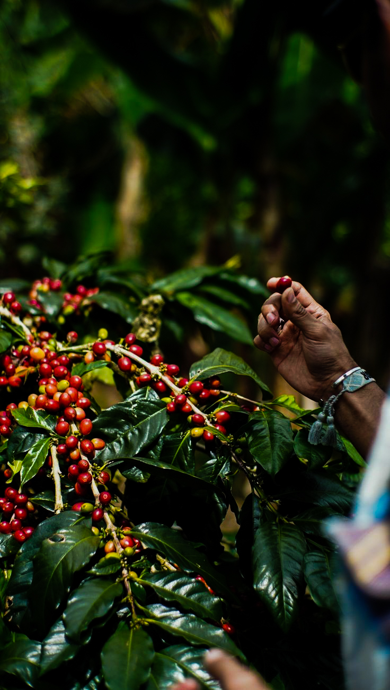
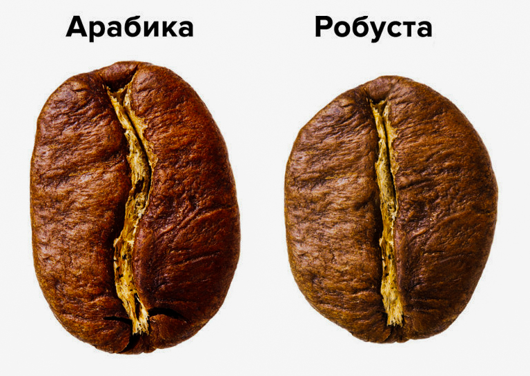
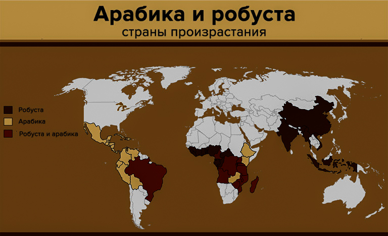
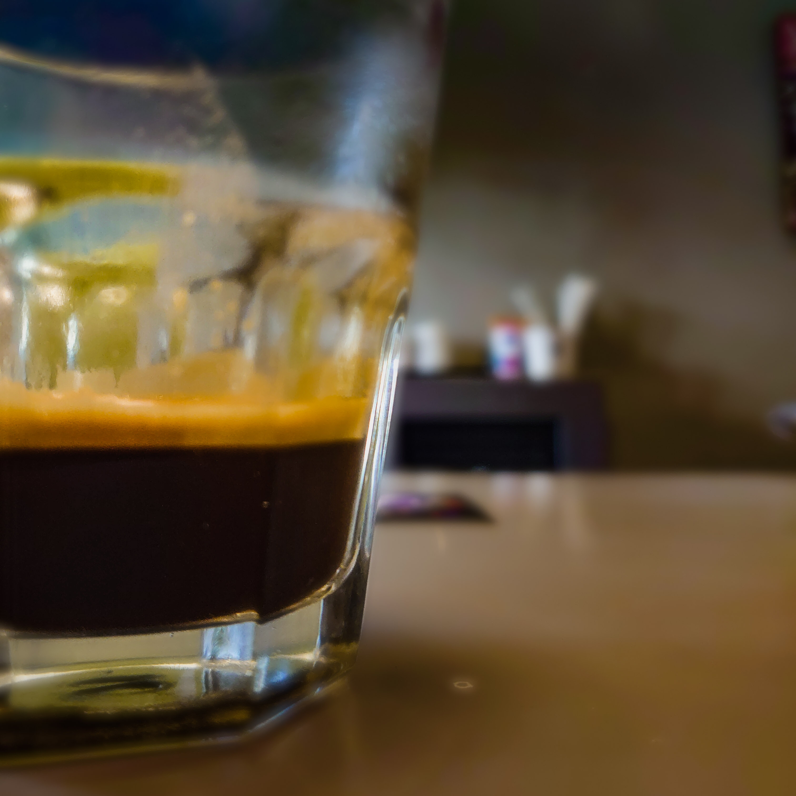

# Разница между арабикой и робустой

Арабика и робуста — два вида кофе, которые выращивают в промышленных масштабах. Есть и другие, но на них приходится меньше двух процентов мирового урожая: либерика, эксцельса, эужениоидис.

Из этих двух видов арабика — примерно 70%, робуста — 30%. Причин популярности арабики много, главная простая: она вкуснее. При этом растения — родственники. Арабика появилась от скрещивания робусты и эужениоидиса.

Эужениоидис растёт небольшими кустами, зерно мелкое, урожая мало. Кофеина в нём всего около 0,2%. Поэтому в арабике кофеина меньше, чем в робусте.

*Ручной сбор кофе*

Арабика и робуста по-разному выглядят, растут, пахнут и стоят.

*Арабика вытянутая, робуста более круглая*

## Условия произрастания

Арабика капризна. Она растёт на высоте от 600 до 2000 метров, иногда выше. Выращивать её дорого: дерево легко болеет, нужны уход, удобрения, а где-то ещё и полив.

Робусте важно тепло, поэтому она живёт в тропиках. Всё остальное вторично: равнина или горы, жара, ливни. Она меньше болеет и не требует такого ухода.

*47 стран, в которых выращивают кофе*

> Для сравнения: в 2011 году Бразилия вырастила около 2 080 000 тонн арабики. Вьетнам, второй производитель, — около 660 000 тонн робусты. Это в три раза меньше, хотя вся площадь Вьетнама в пять раз меньше площади одних только бразильских кофейных плантаций.

## Вкус

В арабике много липидов и сахаров — отсюда интенсивность и кислотность. В конкретном лоте можно почувствовать ягоды, цитрус, цветы, орехи.

В робусте больше кофеина и хлорогеновой кислоты, меньше липидов и сахаров. Это бодрит, но даёт горечь и тяжёлый аромат. Вкус терпкий и плоский. Оттенков, как у арабики, от неё почти не добиться.

*Пенка сверху — крема. Робуста даёт её больше, чем арабика*

Уход на ферме важнее вида. Хорошая робуста, за которой следят, будет лучше заброшенной арабики.

Растворимый кофе почти всегда делают из дешёвой робусты. Бывает и из хорошего спешелти — тогда он стоит соответственно.

## Цена

Арабика дороже: горы, сложнее выращивать, возить и [обрабатывать](../003-ru-coffee-processing-methods/). Плюс удобрения и полив. В плохой год дерево легко болеет, и уцелевший урожай становится ещё дороже.

Робусте не нужна высота. Она выдерживает дожди и жару, лучше сопротивляется болезням. Деревья в три–четыре раза больше арабики и вырастают до 13 метров, урожая больше. Поэтому робуста заметно дешевле.

| Робуста | Арабика |
| --- | --- |
| 1500–1700 $ за тонну в среднем | 2600–4100 $ за тонну в среднем |

Это биржевые ориентиры на «просто робусту» и «просто арабику». Качественный кофе стоит намного дороже.

В кофейнях среднего уровня часто мешают арабику с робустой: дешевле, а вкус ещё не ломается окончательно.

## Если арабика вкуснее, зачем робуста

У каждого вида свои задачи и свои фанаты. Кто-то считает, что робусту вообще не стоит использовать. Кто-то ищет сорта, которые рядом с арабикой открывают новые вкусы.

Робуста даёт эспрессо больше крема, плотности и тела. Но часто добавляет неприятную горечь. Это не значит, что из неё нельзя приготовить ничего хорошего.

Классический итальянский кофе — почти всегда тёмно обжаренная смесь арабики и робусты. Она дешевле чистой арабики и даёт характерную горечь. В капучино из такой смеси иногда появляются шоколадные ноты — кому-то это нравится больше.

Альтернативой робусту заваривать обычно не стоит. Френч-пресс, турка, пуровер — лучше арабика.

Правило одно: хороший кофе — тот, о котором заботились. Плохой кофе — это не арабика и не робуста. Это кофе, который бросили.
