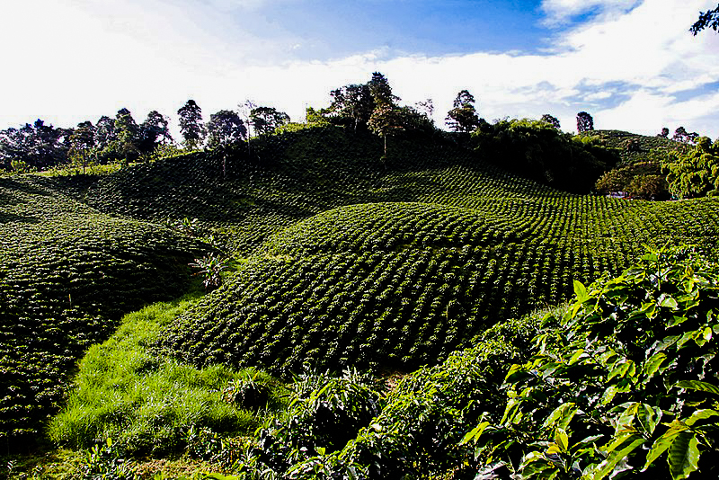
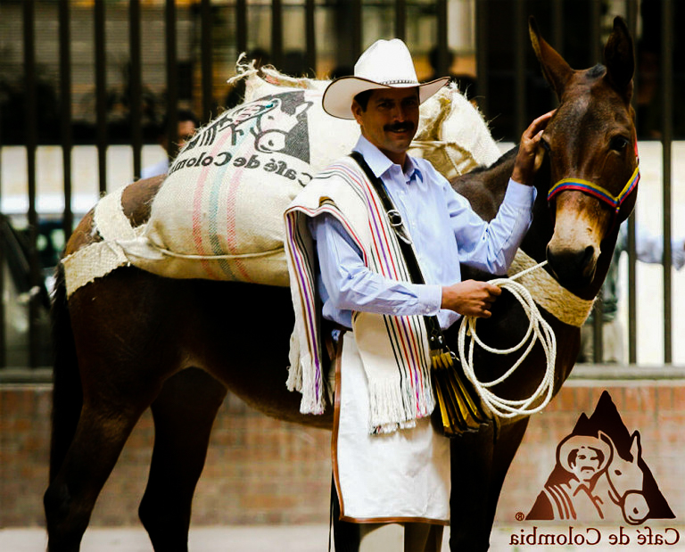
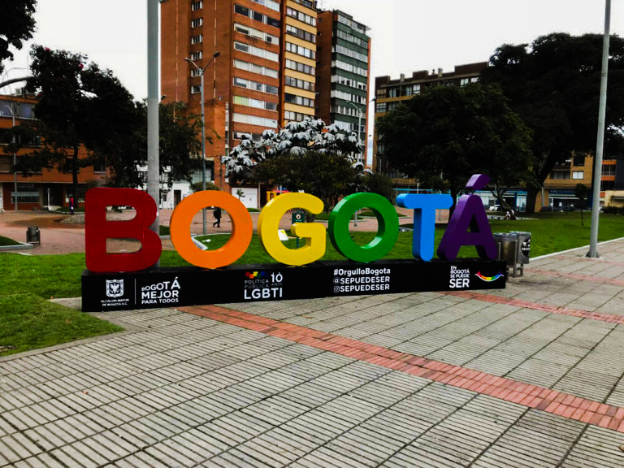
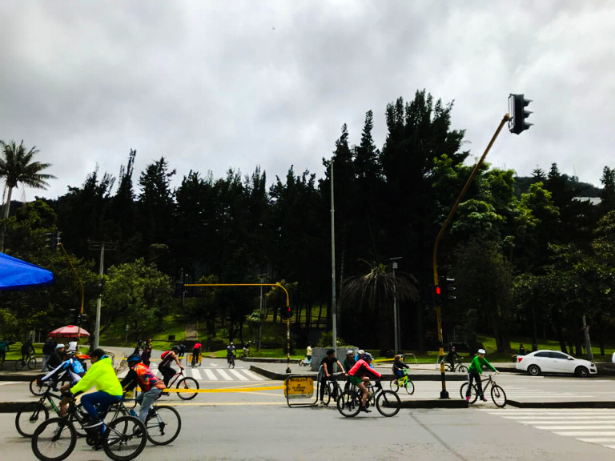
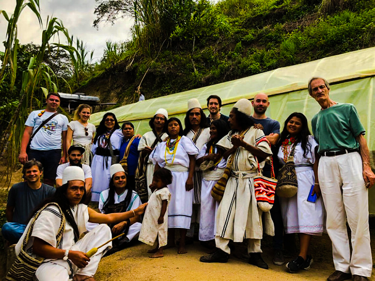
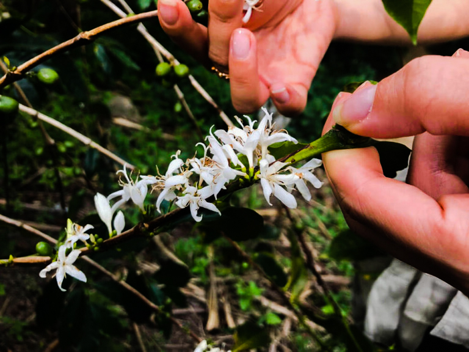
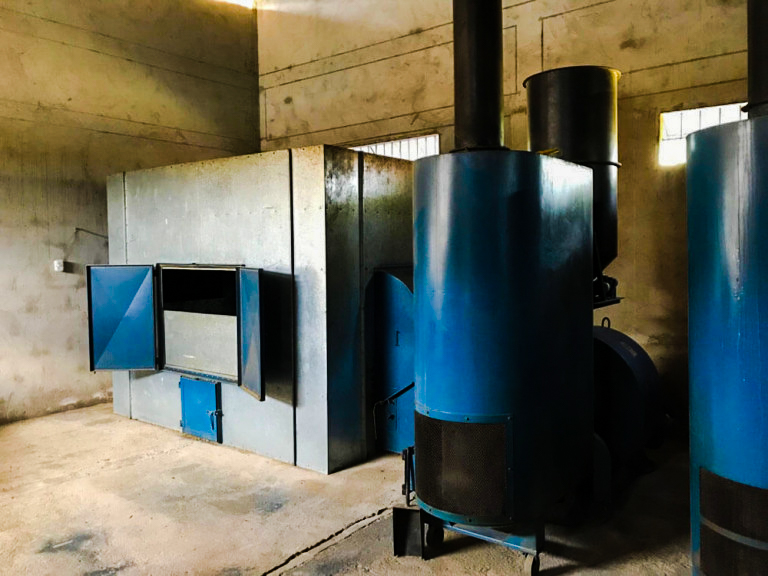
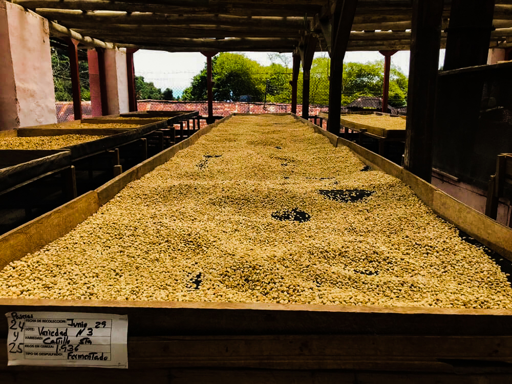
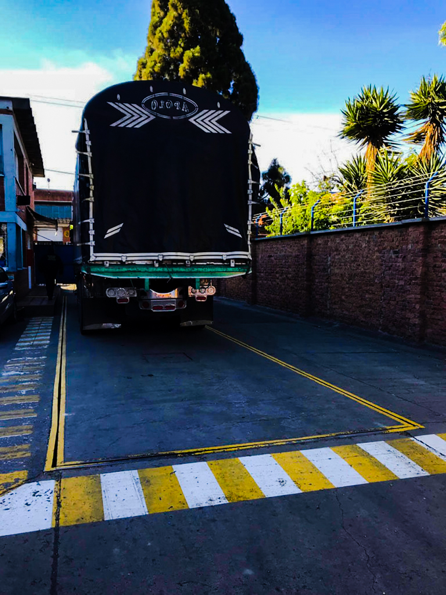
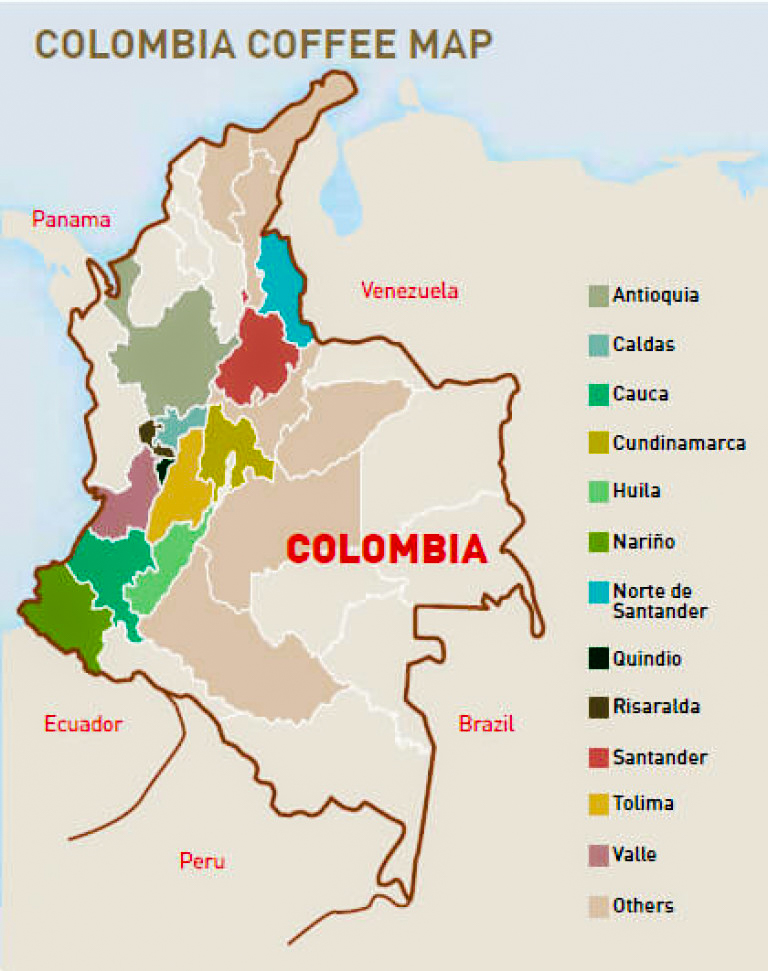

# Особенности кофейной индустрии в Колумбии

Колумбия — первый в мире производитель мытой арабики и второй, после Бразилии, по арабике вообще.

*Кофейная плантация в Колумбии*

## Как кофе появился в стране

Историки до сих пор спорят, когда сюда привезли первые саженцы. Чаще всего называют 1723 год. Первая большая плантация появилась в 1835-м. Стремительный рост начался в конце XIX века, вместе со спросом в Европе. К началу XX века кофе давал около половины всего колумбийского экспорта.

Во второй половине XX века началась гражданская война. Выросли преступность и производство кокаина. Владельцы плантаций боялись вооружённых групп и уходили с земли. Мелкие фермеры переезжали в города, где была армия. В затишье возвращались на фермы, при обострении снова уезжали. Официально война закончилась только в 2016 году.

Война и плантации коки на бывших кофейных землях долго были главной проблемой отрасли.

## Бренд «колумбийский кофе»

Чтобы выделиться, страна продвигает бренд «Колумбийский кофе» как торговую марку.

В 1958 году придумали персонажа — фермера Хуана Вальдеса. С тех пор на каждый экспортный мешок ставят логотип и надпись Café de Colombia. За картинкой стоят жёсткие стандарты качества. Имидж качественного кофе здесь не только маркетинг.

*Съёмки Хуана Вальдеса для рекламы*

## Климат и жизнь в стране

Богота — большой город контрастов: богатство рядом с бедностью, красивые дома рядом с трущобами. Пробки одни из самых тяжёлых в мире. Зато общественный транспорт здесь сильный: отдельных полос для автобусов много, сами автобусы длинные, с двумя–тремя вагонами. Метро нет, но наземный аналог работает быстро.

*Многие в Боготе ездят на велосипедах*

Экономика тесно связана с кофе. Больше 500 тысяч семей заняты выращиванием, сбором, обработкой или экспортом. Кофе даёт около 4% ВВП и 37% занятости в сельском хозяйстве.

Колумбия — горы до 2200 метров. Кофе растёт на крутых склонах, поэтому его собирают только руками. Страна на экваторе, высоты разные — урожай снимают почти круглый год. На одном дереве бывают и цветы, и зелёные ягоды, и спелые.

Два основных сбора: main crop и митака. Митака меньше и обычно чуть слабее по качеству. Главная сложность — успеть собрать ягоды, когда они покраснели, но ещё не перезрели. Рук нужно сразу много. Во время митаки ягод меньше, собирать можно тщательнее — это частично выравнивает вкус.

Фермы маленькие, в среднем около 3 гектаров, часто в горных лесах, в тени деревьев. На машине туда не всегда доехать, поэтому ездят на лошадях и ослах. С одного дерева в среднем выходит около 1 кг зелёного зерна. За сезон фермер производит примерно 100 мешков по 70 кг — это около 7 тысяч деревьев.

*Кооператив «Анеи» в регионе Сьерра-Невада*

*Цветение кофе*

## Обработка

Климат влажный, на высоте прохладно, поэтому кофе в основном моют. Сушка особенно важна: если её сделать плохо, вкус пострадает.

Многие досушивают зерно в механических сушилках: сначала 20–25% влаги на воздухе, затем до 12% в машине. Если сушить выше 40 °C, зелёный кофе хуже хранится: водная активность остаётся высокой.

*Механическая сушка на вет-милле*

Долго натуральную обработку почти нельзя было экспортировать без письма от покупателя: во влажном климате ягоды легко гниют и плесневеют. Сейчас спешелти просит эксперименты, и небольшие лоты натуралки уже делают. В больших объёмах — нет.

Обработка делится на вет-милл и драй-милл. На вет-милле снимают мякоть, смывают остатки и сушат до 12% — получается пачмент. Обычно это делают сами фермеры в горах: возить ягоды тяжело, они почти в десять раз тяжелее сухого пачмента и легко портятся. Иногда фермеры строят общую станцию.

*Сушка пачмента на африканских кроватях*

Потом пачмент сдают на драй-милл — обычно в городе, у экспортёра. Там смотрят дефекты, вкус и влажность и покупают кофе у фермера. Редкие успешные фермеры продают сами и только платят за услуги милла.

Хороший лот оставляют отдельно, чтобы покупатель видел всю историю зерна. Обычный кофе смешивают в однородные лоты «Супремо» и «Эксельсо». О таком зерне известно немного: дефекты и регион драй-милла.

*Взвешивание грузовика с пачментом на драй-милле*

На драй-милле кофе может лежать до шести месяцев, пока не придёт заказ. За это время водная активность пачмента стабилизируется. Затем халлинг, мешки и отправка.

## Разновидности

Национальный институт Сеникафе выводит деревья под колумбийский терруар. После вспышек ройи — кофейной ржавчины — появились более устойчивые кастильо и колумбия. Фермерам, которые сажают рекомендуемые разновидности, дают государственные гарантии по кредитам.

Чаще всего выращивают катурру и кастильо: первая урожайная, вторая лучше держит ройю. Всё чаще встречаются гейша, руме судан и другие — спешелти просит новые вкусы.

## Регионы

Основные районы: Нариньо, Сантандер, Антьокия, Каука, Кундинамарка, Уила, Толима, Киндио и Сьерра-Невада. Кофейный ландшафт региона Паиса даже под защитой ЮНЕСКО. У каждого региона свой микроклимат и свой вкус.

## Классификация

Сеникафе делит экспортное зерно по размеру:

1. Supremo — скрин 17 и выше;
2. Excelso — скрин 15–16;
3. UGQ (Usually Good Quality) — всё остальное.

Это только размер, не качество. Перед экспортом зерно ещё смотрят на дефекты. Образец — 500 г:

1. Грейд AA — без полных первичных дефектов, до пяти вторичных, без повреждений насекомыми.
2. Грейд A — до трёх первичных и до восьми вторичных.
3. Грейд B — до восьми первичных и до тридцати пяти вторичных.

## Коротко

Колумбия интересна сразу несколькими вещами: экватор, урожай почти круглый год, сильный терруар, прослеживаемость лота до фермера и предсказуемые государственные институты. Здесь можно не только купить хороший кофе, но и понять, как каждый этап меняет вкус.
