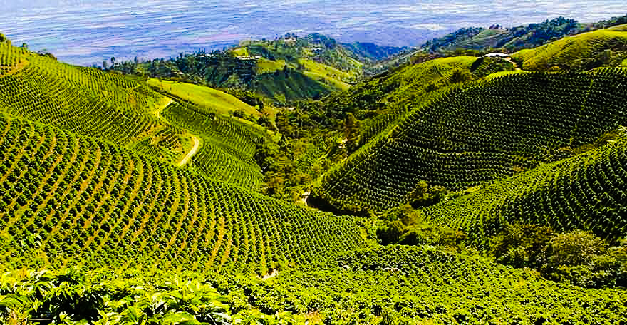
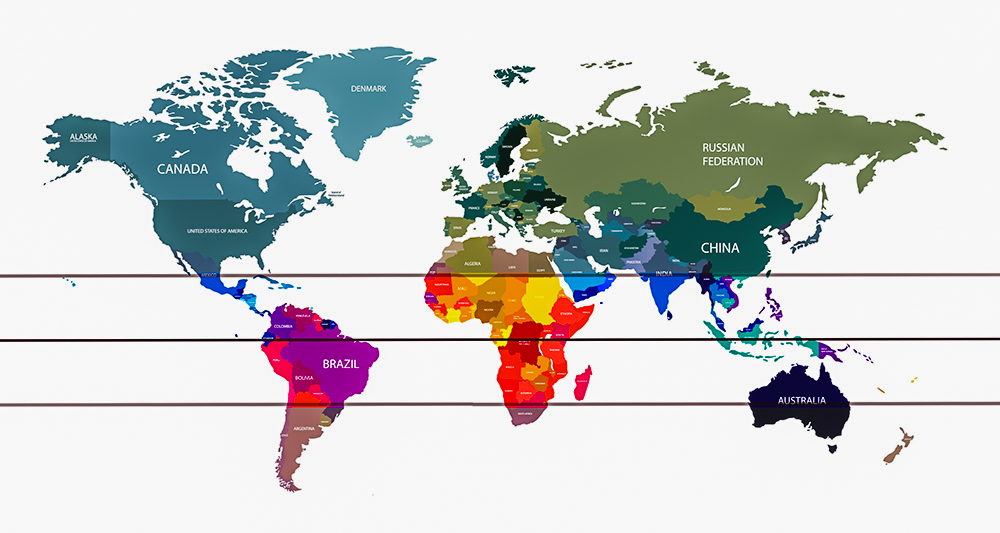
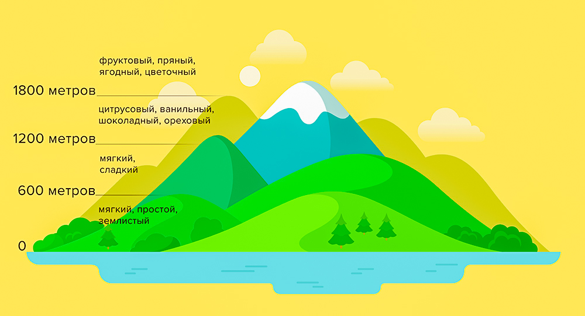

# Как климат плантации влияет на вкус кофе

*Кофейная плантация в Кении*

Кофе очень чувствителен к месту, где растёт. Условия вместе называют терруаром:

1. осадки;
2. почва;
3. температура;
4. свет;
5. высота плантации.

## Осадки

Если дождя меньше 80 см в год, почва сохнет, урожай маленький, зерно мелкое. Если больше 300 см, вода вымывает питание, корни гниют.

Удобный диапазон — 150–250 см, равномерно в течение года, и ещё 1–2 сухих месяца к сбору. Частые дожди вызывают цветение, но потом нужна пауза, чтобы бутоны не побило и ягода дозрела.

Мало дождя всегда плохо. Много — зависит от почвы, солнца и того, как дожди распределены.

## Почва

Из почвы дерево берёт воду, азот, фосфор, калий, кальций и магний. Почва не должна быть ни сухой, ни болотистой. Нужен дренаж: лишняя вода уходит, в засуху влага остаётся.

Если вода стоит, в корнях появляются плесень и грибок. Если почва пересыхает, ягода остаётся без питания.

> В почве должна быть глина: тогда вода уходит, но земля не высыхает насквозь.

Лучшим часто считают суглинок: 40% песка, 40% ила, 20% глины. Такая почва «дышит», держит влагу и меньше болеет.

## Температура

Коротко: днём тепло, ночью прохладно. Большой перепад замедляет созревание. Ягода набирает больше сладости, тела, кислотности и сложности.

*Кофейный пояс: днём тепло, ночью без заморозков*

Ночью не должно быть ниже 0 °C, днём — выше 30 °C. На морозе дерево гибнет за минуты, на сильной жаре — за часы. Удобный перепад — 15–30 °C, без выхода за эти рамки.

## Свет

Кофе любит тень и не любит прямой солнцепёк. Много света — быстрое созревание и большой урожай, но вкус простой. В тени ягода зреет дольше и набирает больше фруктовых и цветочных нот.

Облачность даёт тень. Хорошо, когда дожди идут вечером: тучи закрывают солнце, воздух чуть остывает.

Важна и сторона склона. Запад получает жёсткое послеобеденное солнце. Восток — мягкий рассвет. Восточные плантации обычно лучше.

## Высота

Почти всегда верно: чем выше, тем интереснее кофе. На высоте прохладнее, перепады температуры больше. Ягода дольше зреет и успевает набрать сложные сахара.

Почва там чаще каменистая и глинистая, с хорошим дренажем. Деревья меньше голодают и болеют.

Арабика обычно растёт на 900–1800 метрах. Это ориентир: в Африке бывает около 2000 метров, на Гавайях из-за холодного микроклимата — около 600. Выше уже слишком холодно.

*Один из самых высокогорных кофе растёт в Йемене, на 2000–2500 метрах*

Робуста проще. Она растёт ниже и в менее идеальных условиях. Вкус землистее, без кислотности, с яркой горечью. Это не делает её «плохой» — у неё свои поклонники. Подробнее о [разнице арабики и робусты](../005-ru-difference-between-arabica-and-robusta/).

## Какие климаты подходят

Для арабики обычно два варианта:

1. Субтропики в 16–24° от экватора. Чёткие дождливый и сухой сезоны, высота 600–1200 метров. Так растут Мексика, Ямайка, Зимбабве и около 80% бразильского кофе.
2. Экваториальные области до 10° широты, высота 1100–1900 метров. Здесь чаще получают [спешелти](../009-ru-specialty-coffee/). Из-за частых дождей в Кении и Колумбии урожай снимают два раза в год.

Робуста растёт примерно в 10° к югу и северу от экватора, на высоте 0–600 метров.

Терруар — не всё. Ещё влияют разновидность, [обработка](../003-ru-coffee-processing-methods/), хранение, обжарка, [вода](../020-ru-water/) и способ приготовления.
