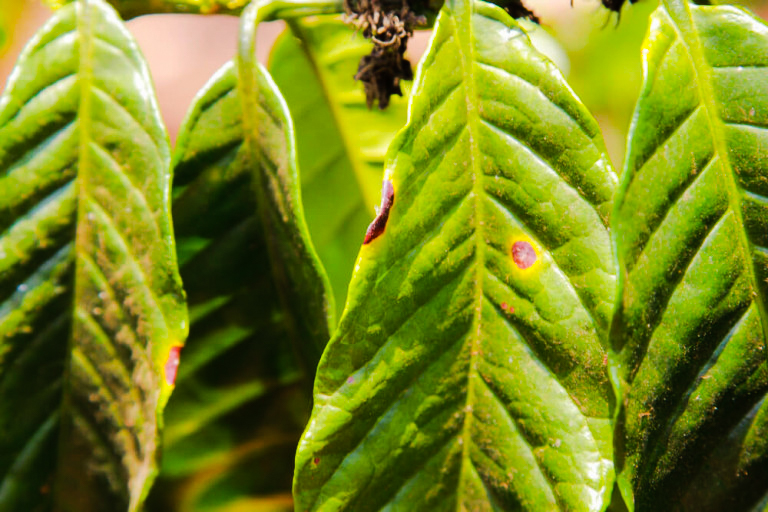
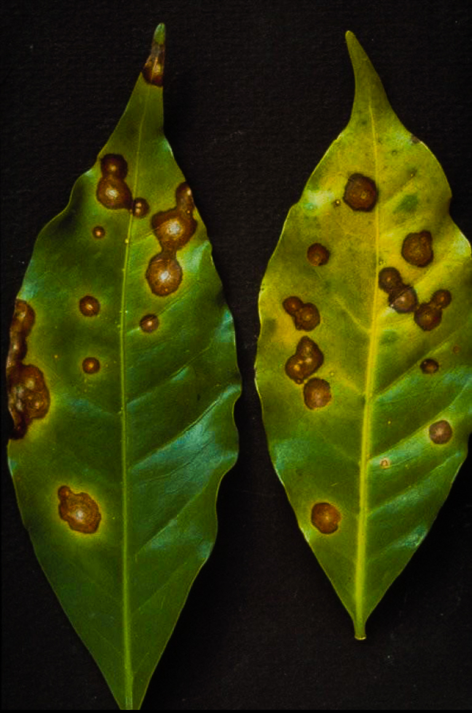
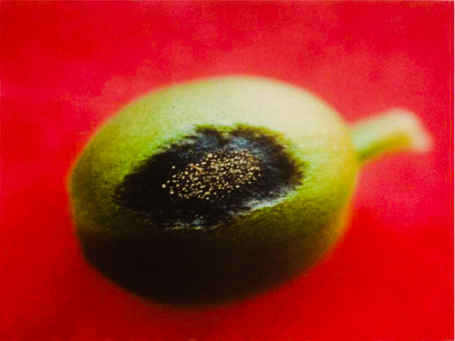
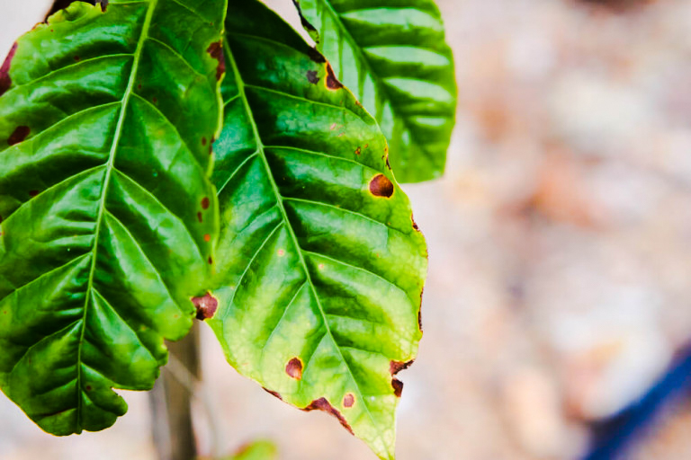
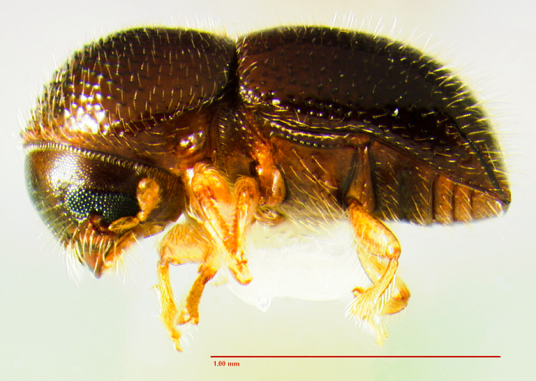
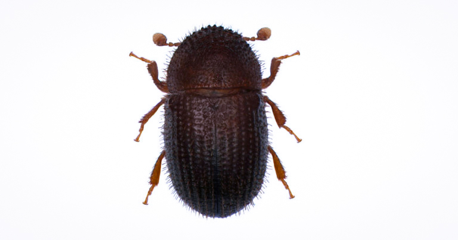
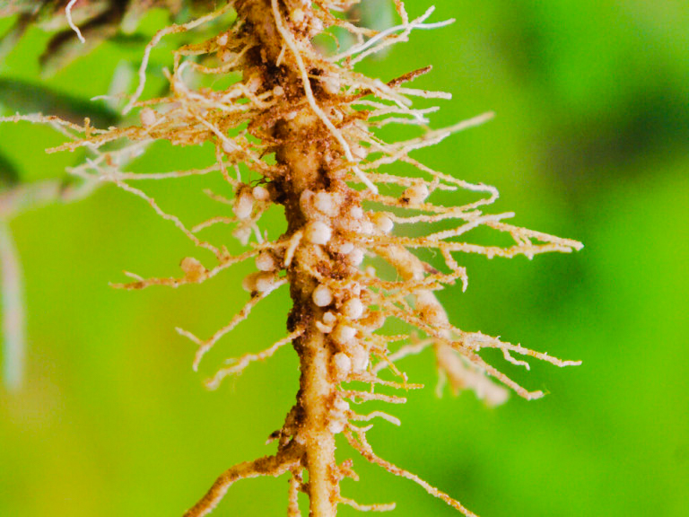

# Болезни кофейных деревьев

На урожай, вкус и цену влияют много вещей. Одна из самых неприятных — грибки и насекомые. Они портят деревья и ягоды, а иногда уничтожают урожай целиком.

Есть теория, почему арабика так легко болеет. Почти все плантации мира пошли от нескольких саженцев, которые вывезли из Йемена на остров Реюньон. Узкий генетический материал — слабая защита.

В отличие от [климата](../007-ru-influence-of-climate-on-the-taste-of-coffee/), к которому фермеры могут только приспособиться, болезни уже неплохо изучены. С ними умеют бороться.

## Грибки

Они быстро эволюционируют и могут пройти по плантации почти сразу. Три самых частых:

**Коричневая пятнистость** (*Cercospora coffeicola*) бьёт и по листьям, и по ягодам. На листьях серовато-белые пятна. На зелёных и жёлтых ягодах — коричневые, на красных — чёрные и крупнее. Иногда грибок доходит до зерна. Встречается во всех странах-производителях и может забрать до 15% урожая. Чем ближе к экватору, тем выше риск. Фермеры отвечают уходом и медьсодержащими фунгицидами.

**Болезнь кофейной ягоды (CBD)** бьёт ягоды на любом этапе. Иногда это несколько тёмных вмятин, иногда ягода гибнет за несколько дней. Потери могут доходить до 80%. Пока болезнь в основном живёт в Африке, на больших высотах с высокой влажностью. Иногда появляется в Южной Америке. Лучшая защита — те же медьсодержащие фунгициды.

**Кофейная ржавчина** (*Hemileia vastatrix*) — самая распространённая болезнь кофейных деревьев. Пятна жёлтые или оранжевые. Грибок ломает фотосинтез, листья остаются без питания и гибнут, за ними — дерево. В 2012 году эпидемия в Латинской Америке сильно подняла цены. В конце XIX века Шри-Ланка, Филиппины и другие страны Юго-Восточной Азии из-за ржавчины почти бросили кофе и ушли в чай.

В 1960 году Колумбия наняла учёных Сеникафе. Они знали, что грибок бьёт в основном арабику, и начали выводить новые деревья. В 1980-м появилась колумбия — гибрид катурры и Тимора. В 2005-м — более устойчивый кастильо. В 2016-м — Сеникафе 1, на который ещё надеются.

## Насекомые

Кофеин в ягоде — защита от вредителей. Некоторые насекомые к нему нечувствительны.

**Black twig borer** (*Xylosandrus compactus*) — тёмно-коричневый жук около 2 мм. Забирается в веточку и откладывает яйца. Личинки точат ходы дальше. Кроме кофе он ест чай, какао и авокадо. Особенно опасен для молодых саженцев, если они стоят близко. Защита простая и нудная: убирать листву и мусор, удобрять, смотреть стебли. Заражённые ветки срезают и уничтожают.

**Кофейный жук-бурильщик** (*Hypothenemus hampei*) — пожалуй, самый опасный вредитель отрасли. Чёрный, 1,2–1,8 мм. Проникает внутрь ягоды и уничтожает урожай. Впервые его нашли в Африке, потом случайно завезли во все страны-производители. Он умеет усваивать кофеин.

Против него нужны ежедневные осмотры и инсектициды, если популяция растёт. Жук ещё и запускает ферментацию прямо на дереве — это слышно в чашке. Дефект видно: маленькие дырочки в зерне. Для спешелти в образце 350 г таких дефектов должно быть не больше десяти.

**Нематоды рода Meloidogyne** — червеобразные организмы 0,1–5 мм. Они бьют по корням, дерево хуже питается, рост и урожай падают. Характерный признак — галлы на корнях. Фермеры отвечают биологическими добавками в почву.

## Что это значит для чашки

Болезни — проблема фермеров, не любителей кофе. Зерно с жуками и грибком не получит [класс спешелти](../009-ru-specialty-coffee/), скорее всего не уедет из страны и часто просто уничтожается.

Единственная угроза для нас — цена. После эпидемий урожая меньше, кофе дорожает. Фермерам это тоже невыгодно, поэтому они делают всё, чтобы деревья были здоровыми.
