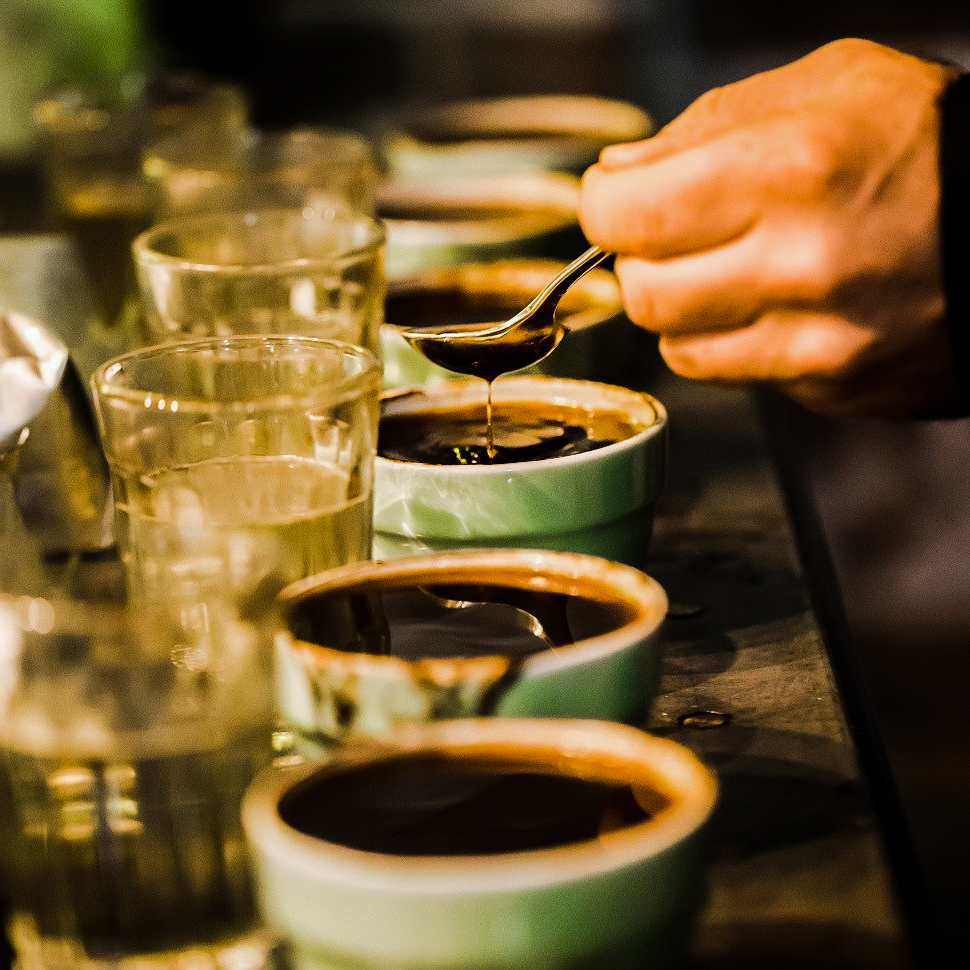
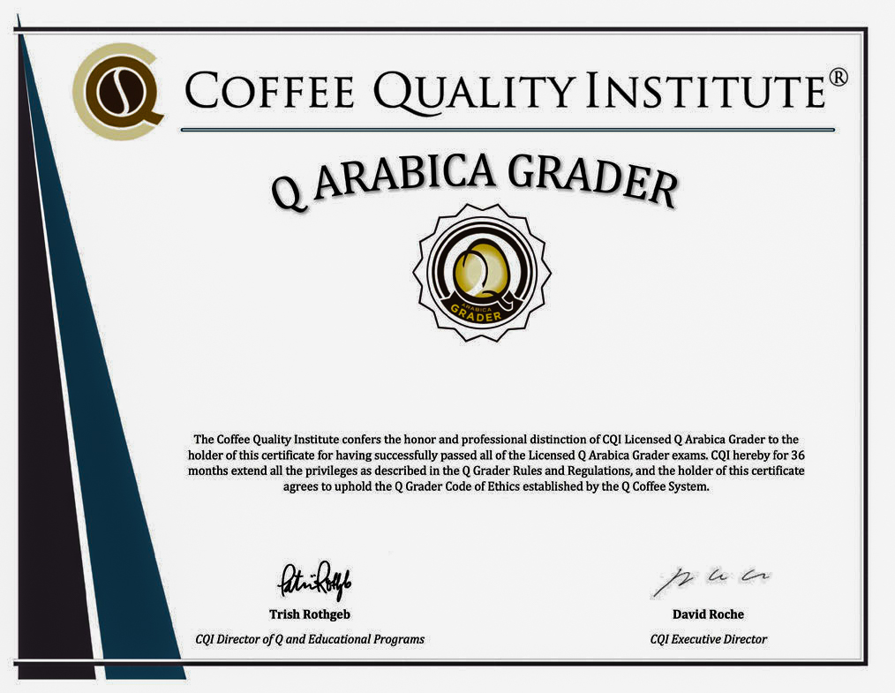

# Что такое спешелти кофе

Путь кофе от ягоды до чашки короткий на словах: вырастили, собрали, достали зерно, высушили, упаковали, увезли, обжарили, приготовили.

Ошибка на любом шаге снижает качество. Если путь прошли хорошо, кофе может получить класс спешелти.

Спешелти — высший сорт, самый качественный кофе. Его дают только арабике, и то меньше чем 10% её производства. Ниже — что может этому помешать и кто решает, хорош ли конкретный лот.

*Капинг*

## Путь от ягоды до чашки

Всё начинается на ферме. Дерево цветёт, ягоды зреют. Чтобы получить спешелти, мало не дать дереву [заболеть](../008-ru-coffee-tree-diseases/). Нужно собирать только здоровые и спелые ягоды.

Потом ягоды быстро везут на обработку: снимают мякоть и правильно сушат. Неровная, слишком быстрая или слишком медленная сушка легко портит кофе.

Перед перевозкой зерно должно отлежаться. Важны температура, влажность и свет. Затем снимают пачмент и упаковывают. Плохая упаковка снова всё ломает.

Сложность в том, что в процессе много разных людей. Даже отличный лот можно испортить обжаркой и приготовлением. Класс спешелти сам по себе не гарантирует уникальную чашку. Смотрят ещё на обжарщика и бариста.

В виноделии ферма часто сама выращивает, делает и продаёт. В кофе такое бывает редко. Спешелти — это зерно, которое прошло все этапы без дефектов и потом его ещё хорошо обжарили и приготовили.

## Кто ставит оценку

*После экзаменов CQI выдаёт сертификат*

Класс дают конкретному лоту. Кения одного урожая, одной обработки и одной фермы может быть спешелти в 2016 году и не получить этот класс в 2017-м.

Решает Q-грейдер. Чтобы получить право оценивать, он учится и сдаёт 20 экзаменов в CQI (Coffee Quality Institute). Смотрят зелёное зерно: дефекты, квакеры, качество обработки и сушки.

Дальше работает система баллов Q, максимум — 100. Кроме зерна оценивают аромат, вкус, послевкусие, кислотность, тело, баланс, чистоту чашки, однородность, сладость и дефекты во вкусе.
