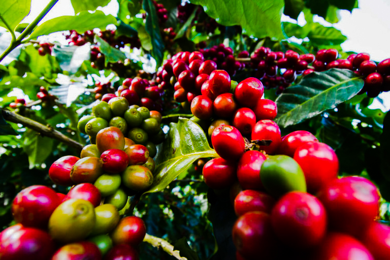
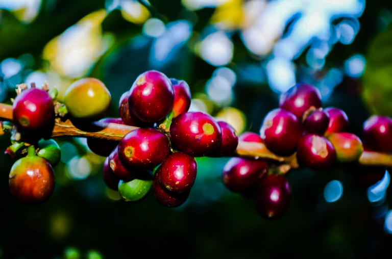
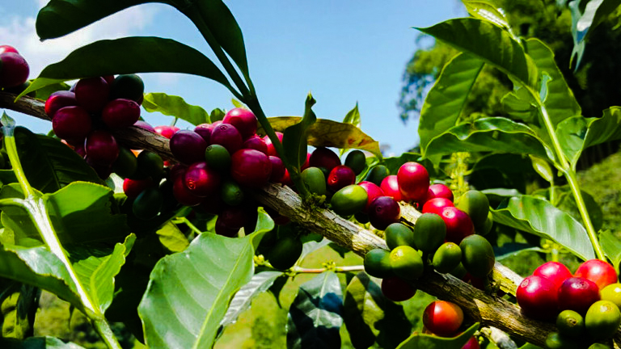
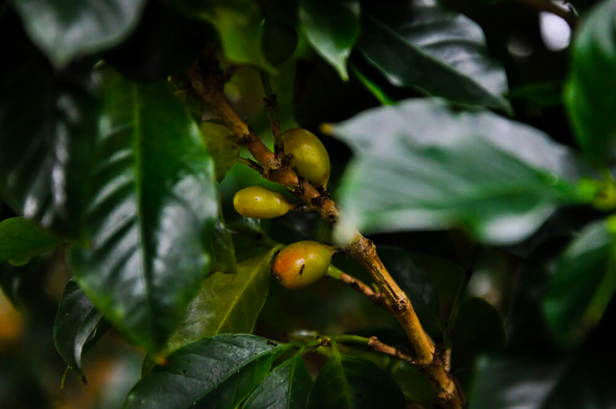
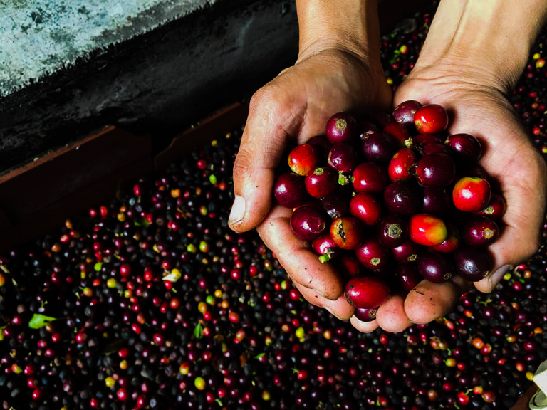
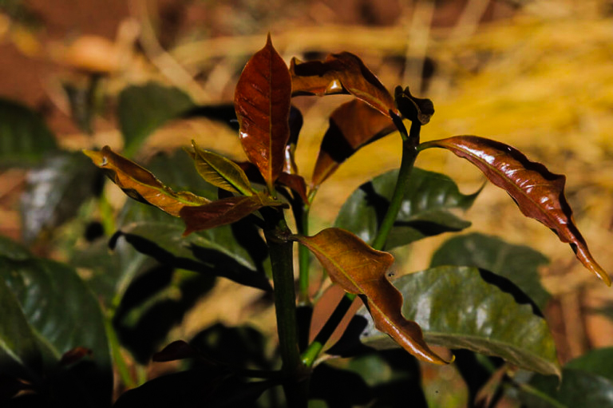
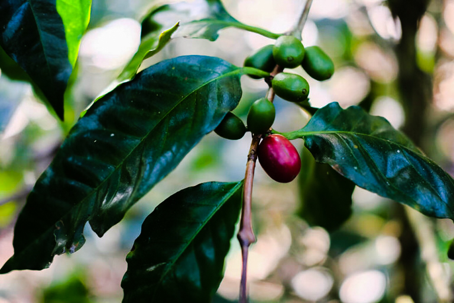
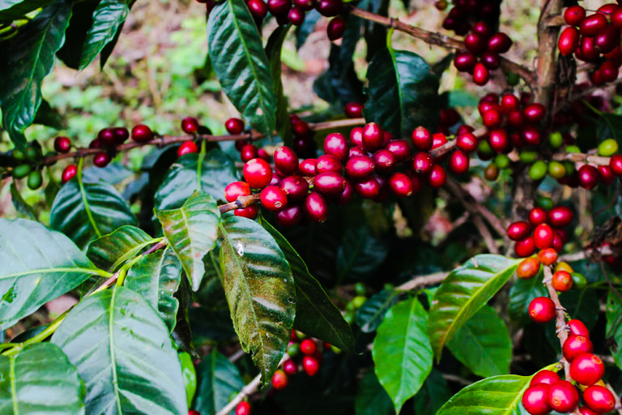
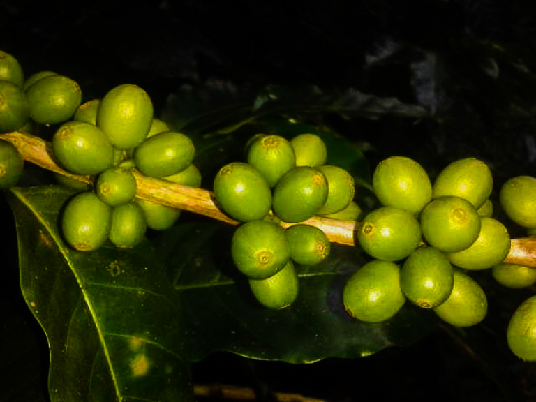

# Разновидности кофе. Часть 2

[Часть 1](../001-ru-varieties-of-coffee-pt1/) · Часть 2

В [первой части](../001-ru-varieties-of-coffee-pt1/) я рассказывал о популярных разновидностях. Их больше 500, и перечислить все не нужно. Здесь — несколько редких, о которых всё же стоит знать.

## Гейша

*Ягоды гейши*

Дикая арабика, которую нашли в 1930-х в Эфиопии, рядом с деревней Геша. Сначала её так и называли — «геша», позже имя стало «гейша». В 1950-х её посадили в Панаме, в Бокете: она устойчива к кофейной ржавчине. Но дерево капризное, любит высоту, ветки ломкие — фермерам она долго не нравилась. Мир узнал гейшу только в 2000-х.

Сейчас её выращивают в Панаме, Колумбии, Коста-Рике, Эфиопии, Танзании и Перу. Ягоды и листья более продолговатые, чем у других. Высота — обычно 1400–1700 метров.

Вкус очень «чистый»: фрукты и цветы, манго, папайя, гуава, персик, ананас, жасмин. Самый известный производитель — Hacienda La Esmeralda, неоднократный победитель Best of Panama. В 2018 году ферма Lamastus Family Estates продала гейшу натуральной обработки по 1770 долларов за килограмм.

При хорошем выращивании и обработке гейша часто набирает больше 90 баллов в каппинге. Отсюда и цена.

## Руме судан

Тоже дикая арабика. Нашли в 1942 году на плато Бома, к юго-востоку от Судана. Растёт на 1500–1800 метрах. Устойчива к [грибковым болезням](../008-ru-coffee-tree-diseases/), проще в уходе, чем гейша, а вкус почти такой же чистый.

Главный минус — очень маленький урожай. Ягоды зреют не одновременно, сбор долгий, а зерна всё равно мало. Поэтому фермеры за неё не хватаются. Зато селекционеры изучают руме судан, чтобы вывести более урожайный гибрид с тем же вкусом.

## Лаурина

Межвидовой гибрид, который нашли в XVIII веке. Сначала он был популярен на Востоке, потом почти исчез: сахарный тростник оказался выгоднее. В 2002 году студент-агроном снова нашёл дерево в Коста-Рике.

Главная особенность — мало кофеина: около 0,6%, у обычной арабики 1,2–1,6%. Кофеин — природный инсектицид, поэтому лаурина слабее защищена от вредителей и даёт мало урожая. Её часто называют природным декафом.

Зато тело лёгкое, напиток больше похож на чай. За это лаурину любят в Европе, особенно во Франции.

## Вуш-вуш

*Ягоды кофе вуш-вуш*

Дикая арабика, как гейша и руме судан. Нашли рядом с деревней Вуш-вуш и назвали в её честь. По аромату близка к гейше, но тело заметно плотнее.

Деревья капризные и малоурожайные. Разновидность ещё «молодая», фермеры её почти не сажают. Встречается на отдельных фермах в Эфиопии и Колумбии.

## Пурпурасенс

Естественная мутация бурбона. Листья с фиолетовым оттенком — отсюда название Purpurascens. Корни сильные, дерево устойчиво к засухе, но урожайность низкая. Выращивают в Центральной Америке, обычно небольшими участками.

## Марагоджип

Мутация типики. Деревья, листья, ягоды и зёрна очень крупные — отсюда второе имя, «слоновье зерно». Визуально почти в три раза больше обычного.

Урожайность низкая и нестабильная: ветки редкие, к болезням дерево слабое. Поэтому зерно дорогое, и фермеров с марагоджипом осталось немного. Его выращивают в Никарагуа, Мексике, Гватемале, Колумбии и Бразилии, где его впервые нашли. Размер зерна везде крупный, а вкус разный — из-за [разного терруара](../007-ru-influence-of-climate-on-the-taste-of-coffee/).

## Пакамара

Искусственный гибрид. В 1958 году Сальвадорский институт исследований кофе скрестил пакас и марагоджип.

В чашке сильные цветочные и пряные ноты, хороший баланс и среднее тело. Деревья любят высоту и тень. К болезням, в том числе к ржавчине и нематодам, пакамара восприимчива. Плюсы — урожайность и крупное зерно.

## Вилла Сарчи

Естественная мутация бурбона. Нашли в 1950-х в Коста-Рике, там её и выращивают. К болезням слабая, зато растёт высоко, а из-за небольшого размера лучше держит ветер.

Как и пакамару, её сажают в тени, чтобы солнце не «сожгло» урожай. Корни хорошие, удобрений нужно мало — поэтому её любят фермеры, которые делают органик. Сейчас учёные скрещивают виллу Сарчи с гибридами Тимора, чтобы получить более устойчивый сарчимор.

## Ибаири

Гибрид мокки и красного бурбона. Очень чувствителен к климату, малоурожайный, ягоды крошечные. Выращивают в Бразилии. Минусов много, но есть один плюс — высокий вкусовой потенциал.

## Что дальше

За последние 50 лет спрос на кофе вырос, а селекционеры и фермеры лучше разобрались в разновидностях. Гибридов становится больше: берут плюсы предков и пытаются убрать минусы.

Из-за культуры спешелти фермеры думают не только о количестве, но и о качестве. На крупных фермах бывает до 150 разновидностей. Запомнить все невозможно — и не нужно.
