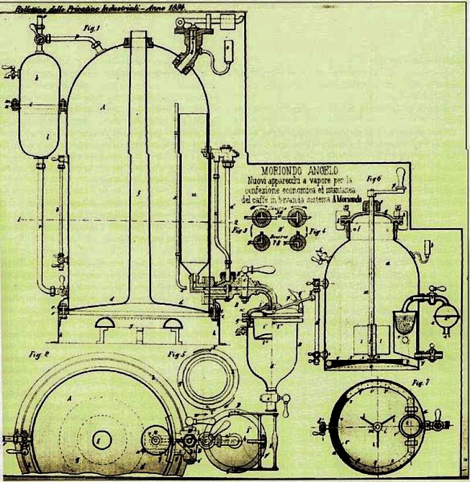
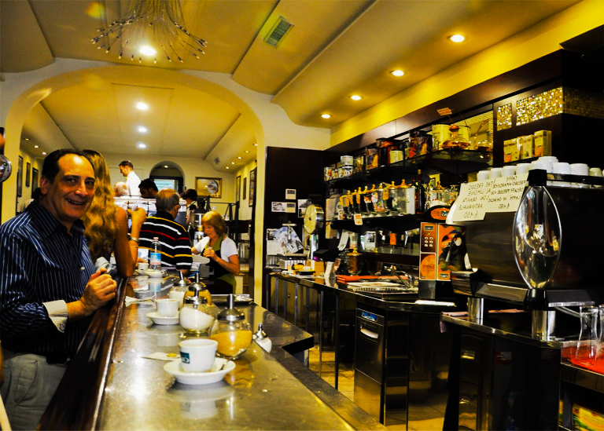

# История эспрессо

## Первые машины готовили почти фильтр-кофе

В 1884 году Анджело Мориондо сделал кофемашину и показал её в Турине. Ему нужно было быстрее поить спешащих гостей своего бара. Напиток назвали эспрессо.

По-итальянски espresso — «выдавленный». Ещё это созвучно с expressly, «специально»: чашка для конкретного гостя, здесь и сейчас.

*Чертёж машины Мориондо*

У аппарата было два бойлера, давление пара — около 1,5 бар. Чашка готовилась примерно 40 секунд, тело было жидким, больше похожим на современный фильтр.

В 1901 году миланец Луиджи Беццера доработал машину: несколько групп и портафильтр, холдер для молотого кофе. Воду грели горелками, стабильного эспрессо не получалось. Из-за скачков давления горячий кофе выплёскивался из группы — работать за стойкой было опасно.

В 1903 году Дезидерио Павони выкупил патент и запустил первую коммерческую машину Ideale. Появились клапан сброса давления и трубка для пара. Кофе перестал выплёскиваться.

К 1920 году слово «эспрессо» уже было обычным. Лексикограф Альфредо Панцини записал: напиток из аппарата под давлением стал привычным делом.

В 1930–1940-х из-за войны кофе в Италии пили меньше, но машины продолжали улучшать.

В 1938 году Акилле Гаджиа сделал машину Lampo: давление уже водой, не паром. В чашке появилась крема — эфирные масла, которые вывариваются под давлением. Горечи стало меньше.

В 1947-м Гаджиа сделал первую машину с пружинно-поршневым механизмом. Давление выросло до 8–10 бар, время приготовления сократилось, напиток стал плотнее.

Дальше машины менялись. В 1961 году вышла знаменитая Faema E61. Принцип и вкус сильно не сдвинулись. Появились только [вариации](../012-ru-espresso-pt1/): ристретто, лунго и молочные напитки на эспрессо.

## Италия изменила мир и почти не изменилась сама

*Итальянцы часто пьют эспрессо на бегу и мало думают о тонкостях вкуса*

Культура [спешелти](../009-ru-specialty-coffee/) растёт по всему миру, а итальянская кофейня с 1930-х живёт примерно так же. Забежать, выпить недорогой эспрессо и идти дальше — ежедневная привычка.

В Италии больше ценят сервис и заряд бодрости, чем сложный вкус. Десятилетиями берут бразильскую натуралку. В 2009 году 43% импорта кофе в Италию была робуста, в США — 22%. На рынке до сих пор сильны крупные бренды вроде Lavazza.

Спешелти почти не сдвинул Италию, зато итальянский кофе сдвинул весь мир. От Сиэтла до Сиднея эспрессо стал основой большинства напитков.

Италия при этом яростно защищает «свой» эспрессо. Правительство пыталось через ВТО ограничить фразу «итальянский эспрессо» — не вышло. Машину изобрели в Италии, но напиток уже не удержать.

Крупным мировым сетям на итальянский рынок всё равно трудно зайти: культура слишком устоялась.
