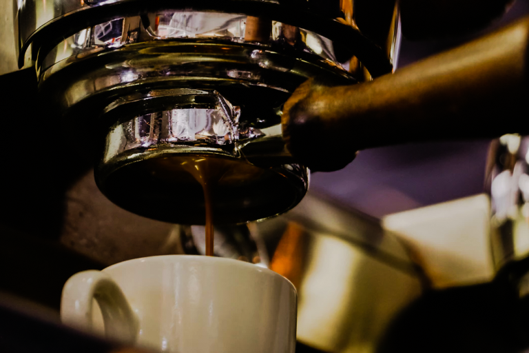
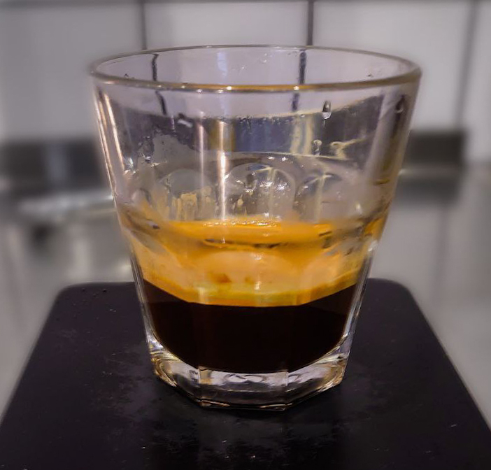
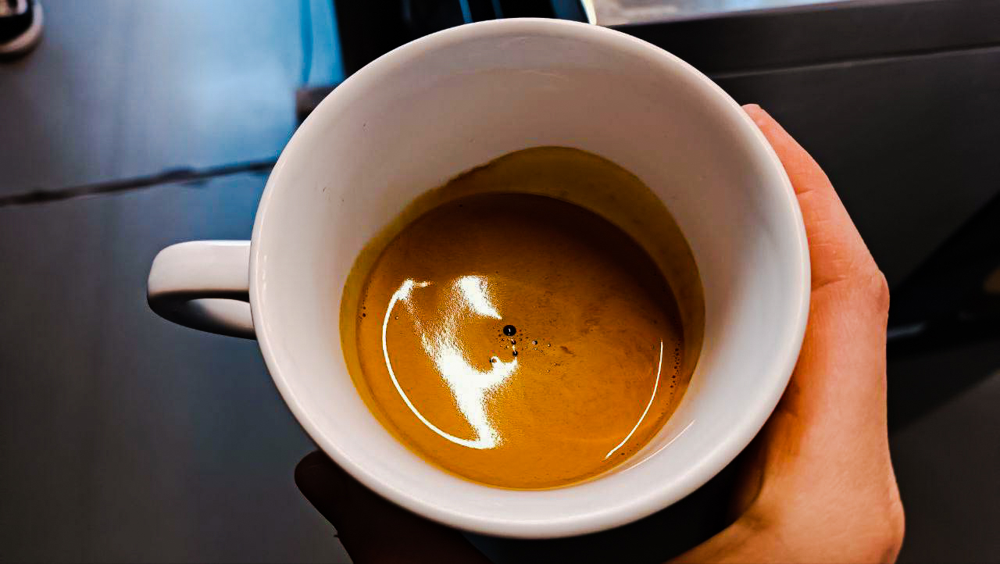
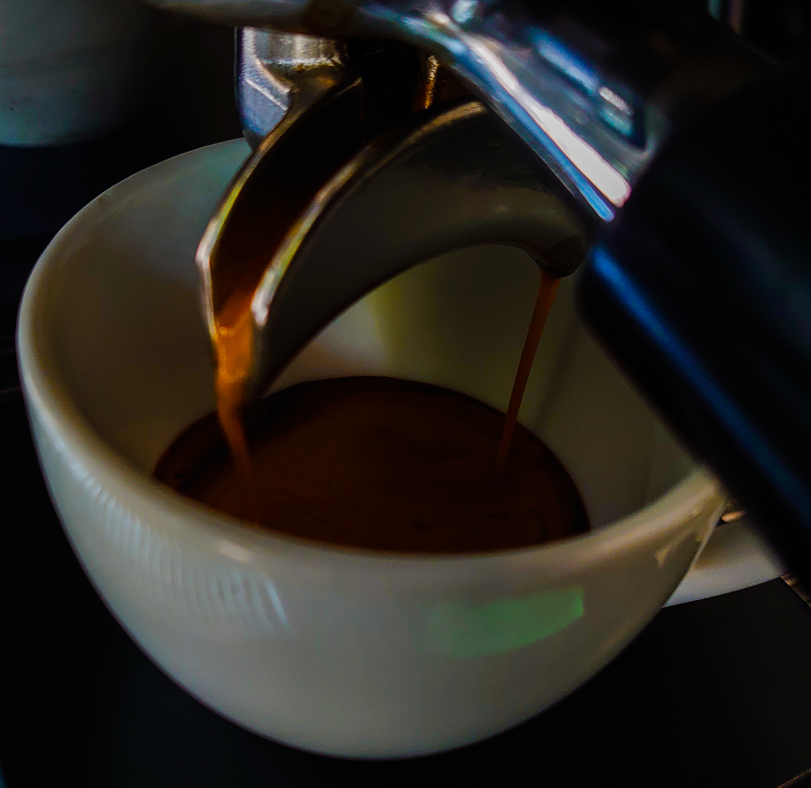

# Эспрессо и его вариации

Часть 1 · [Часть 2](../013-ru-espresso-pt2/) · [Часть 3](../014-ru-espresso-pt3/) · [Часть 4](../015-ru-espresso-pt4/)

Эспрессо — плотный напиток из кофемашины. Вода проходит через кофе и металлический фильтр. Из-за мелких отверстий на поверхности появляется крема: пенка из эфирных масел зерна.

TDS эспрессо обычно от 6% до 15%.

## Соотношение кофе и воды

*Особенность эспрессо — крема на поверхности*

Три напитка отличаются в первую очередь соотношением:

- ристретто — до 1:1,5, TDS от 12%;
- эспрессо — примерно 1:1,6–1:2,5, TDS 8–12%;
- лунго — от 1:2,6, TDS меньше 8%.

Вещества выходят не сразу. Сначала кислоты, потом сахара, потом горечь — кофеин и дубильные вещества. Меньше воды — меньше экстракция. Больше воды — растворяется больше всего.

При одинаковых помоле, дозе и температуре ристретто получается кислотнее и менее горьким, лунго — наоборот. Если крутить время или температуру, можно получить похожий вкус в разном объёме.

## Ристретто

*Ристретто слаще и обычно содержит меньше кофеина*

Это укороченный эспрессо. При той же дозе кофе чашка меньше, соотношение — до 1:1,5. Напиток концентрированнее.

Остальное зависит от зерна. Тёмная обжарка экстрагируется быстрее и легко горчит — для неё ристретто часто подходит лучше всего.

## Лунго

*Чтобы сделать лунго, берут больше воды на ту же дозу кофе*

Лунго — «длинный» эспрессо, противоположность ристретто. Соотношение от 1:2,6. Тело легче, концентрация ниже. Из-за большей экстракции легко поймать горечь. Светлая обжарка экстрагируется медленнее и для лунго обычно безопаснее.

## В чём разница

Все три напитка готовят в одной машине. Меняется только соотношение кофе и воды.

Ристретто концентрированнее, кислотнее и менее горький — если не трогать остальные параметры. Поэтому его часто делают из тёмной обжарки.

Лунго водянистее. Если оставить те же параметры, что у эспрессо, легко переэкстрагировать чашку. Поэтому лунго чаще делают из более светлого зерна.
