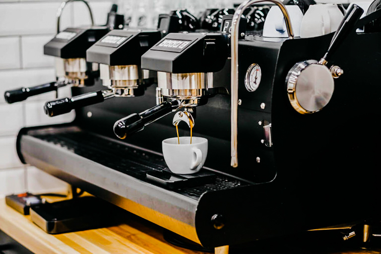
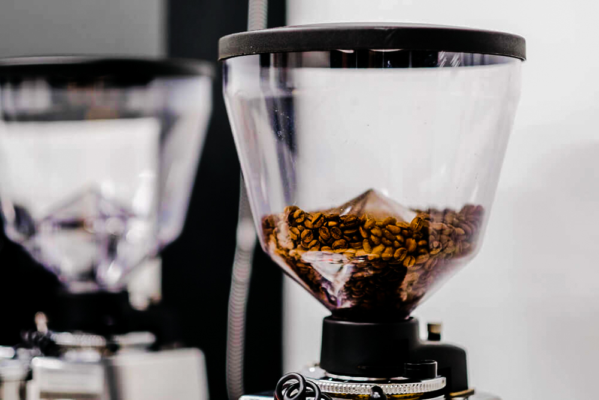
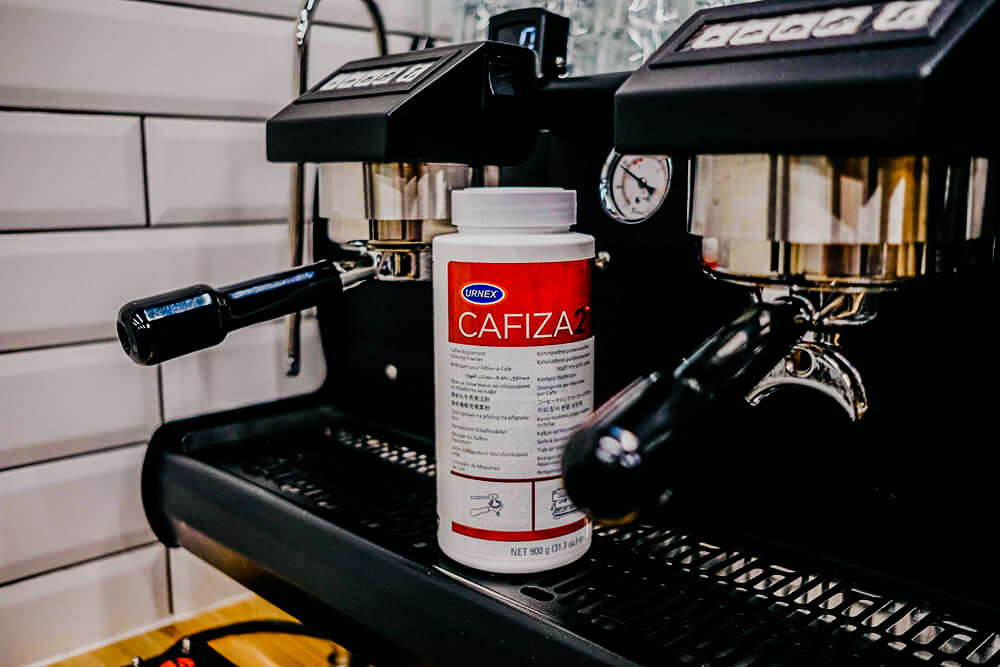
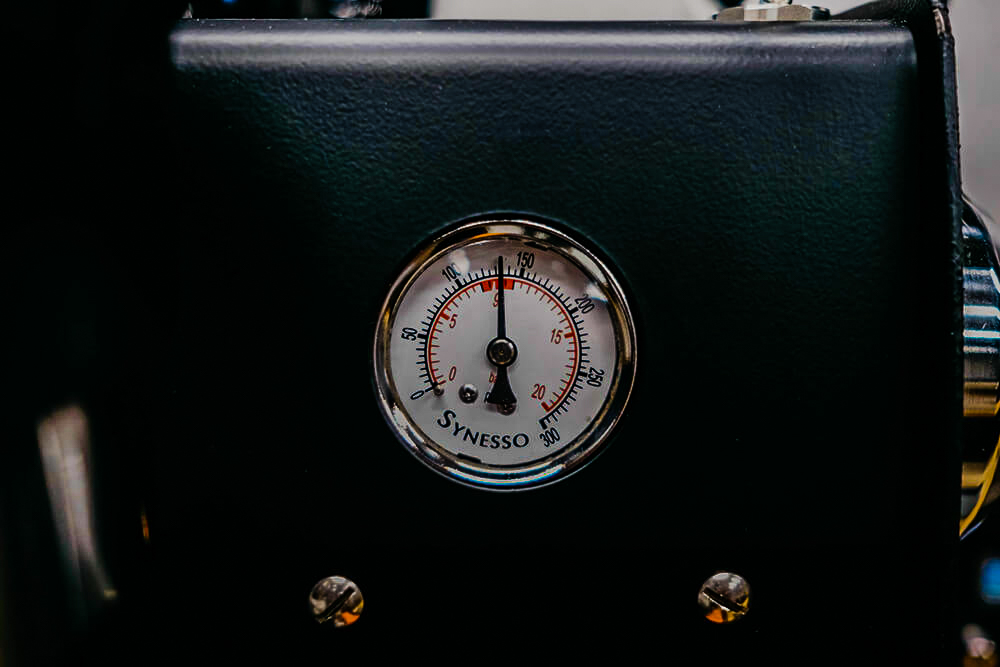
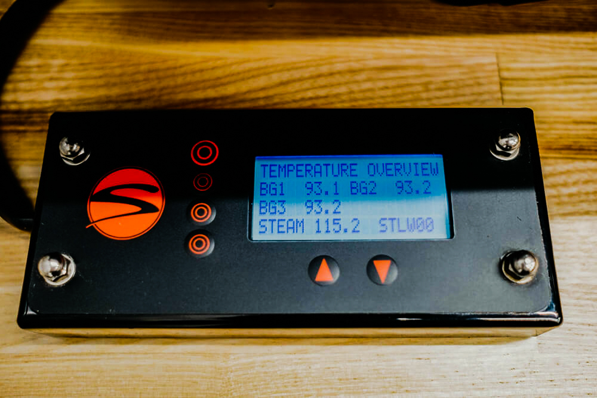
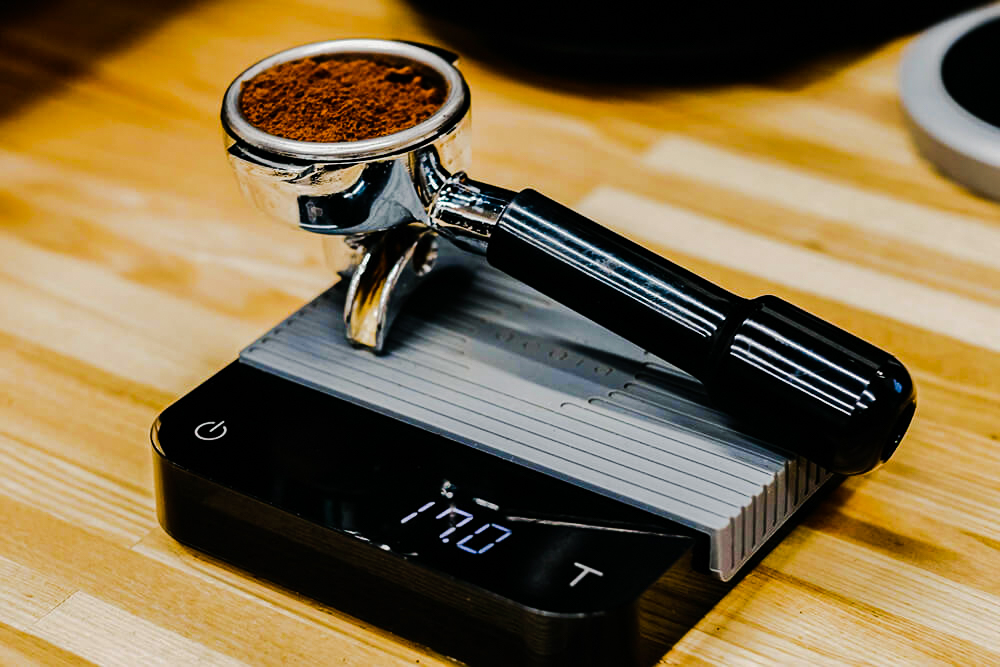
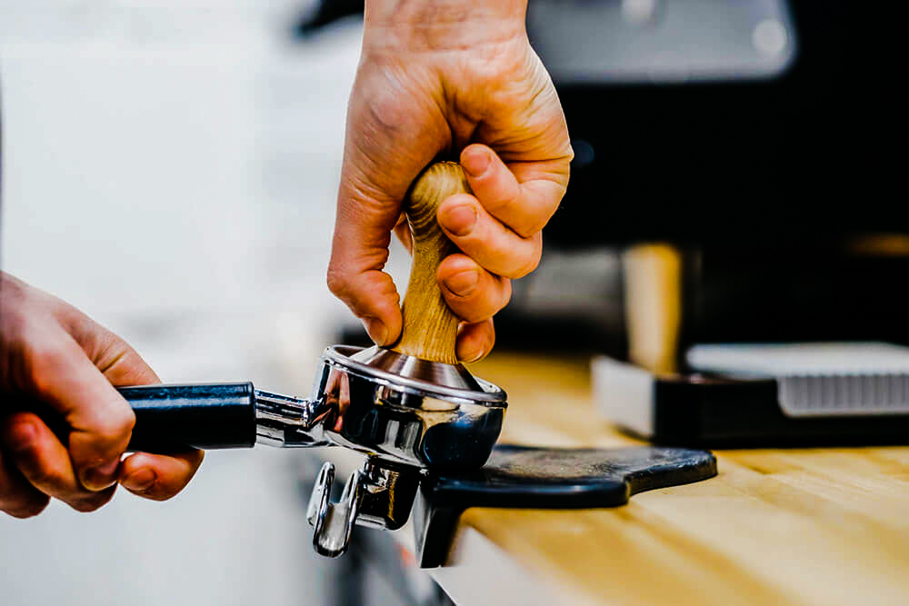
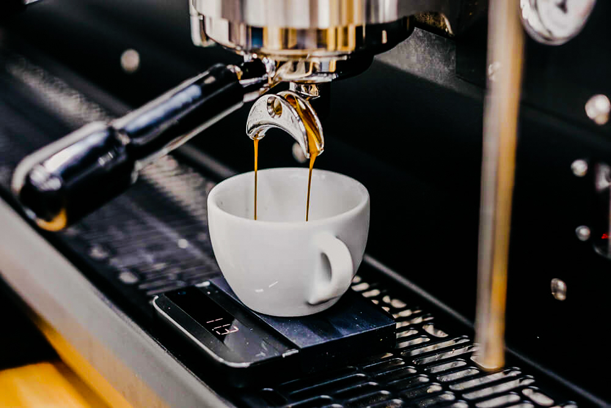

# Руководство по приготовлению эспрессо

[Часть 1](../012-ru-espresso-pt1/) · Часть 2 · [Часть 3](../014-ru-espresso-pt3/) · [Часть 4](../015-ru-espresso-pt4/)

Эспрессо капризный. По консистенции это скорее сироп: плотный напиток с очень интенсивным вкусом.

Чтобы он получился, важны зерно, чистота оборудования, давление, температура, доза, темперовка и время. Ещё нужен опыт: готовишь, пробуешь, делаешь выводы. Общие факторы вкуса я разбирал отдельно, здесь — только эспрессо.

## Зерно

Берите смеси и моносорта, которые жарили под эспрессо. Профиль обычно чуть темнее, чем для фильтра, — так в машине чашка выходит слаще и спокойнее.

Светлую «альтернативную» обжарку для эспрессо лучше не брать: будет резкая кислотность и водянистое тело.

## Чистота

Грязная группа, сетка, корзина, холдер и кофемолка портят вкус быстрее, чем кажется. Масла и старый помол слышны даже в малых количествах.

Холдер и дисперсионную сетку стоит мыть специальным средством каждые 50 порций, но не реже раза в день. Кофемолку — ежедневно щёткой, раз в месяц — химией.

## Давление

Ориентир — 8,2–9 атмосфер. Его настраивают один раз и потом проверяют по манометру: таблетка, холдер в группу, пролив. Как крутить винт — смотрите в инструкции к своей машине.

Цифры — только старт. Вкусный эспрессо бывает и на другом давлении, но начинать лучше с классики.

## Температура

Для фильтра светлую обжарку обычно готовят на 93–95 °C, среднюю на 91–93 °C, тёмную на 89–91 °C. Для эспрессо удобный старт — 93 °C. Так работают на чемпионатах, под это жарят многие обжарщики.

В эспрессо температуру редко крутят каждый день. Вкус чаще ловят помолом и дозой.

На однобойлерных машинах с теплообменником точной цифры может не быть. Тогда ориентир только вкус: слишком кисло — поднять температуру, слишком горько — опустить.

## Доза

Доза зависит от корзины. Лучше двойная: экстракция ровнее. Корзины бывают примерно на 16 г и на 21 г. Удобный диапазон — 17–20 г, и лучше держаться того веса, что написан на сетке.

Если маркировки нет, сделайте несколько таблеток с шагом 1 г и вставляйте холдер без пролива. Когда на таблетке появится лёгкий отпечаток сетки, уберите 3 г — это ваш вес.

Весы с шагом 0,1 г — один из главных инструментов. Взвешивайте каждую порцию.

## Распределение и темперовка

Вода под давлением ищет лёгкий путь. Если в таблетке комочки или перекос, появятся каналы.

Комочки разбивают распределителем или зубочисткой, круговыми движениями. Темпером по холдеру стучать нельзя — ни до, ни после. Это почти гарантированные каналы.

Трамбуйте ровно, со средним усилием, темпером с плоским основанием почти в диаметр корзины. Пуш-темпер с ограничителем помогает не завалить угол. После темперовки уберите крошки с краёв и «ушек», чтобы они не пригорели на прокладке группы.

## Пролив

На теплообменнике перед холдером сбросьте 50–100 мл воды, пока кипяток не перестанет шипеть. На двухбойлерной машине пролив тоже нужен, но короткий: просто смыть остатки кофе с сетки.

Холдер вставили — сразу включайте помпу. Обычно эспрессо идёт 23–30 секунд. Вес напитка — примерно в 1,8–2,2 раза больше дозы. Из 18 г кофе выходит около 32–40 г. Для светлой обжарки чаще 1:2–1:2,2, для тёмной — 1:1,6–1:1,8.

Если чашка вышла слишком быстро — мельче помол, слишком медленно — грубее. Шаги маленькие. После каждой правки промалывайте одну-две порции, чтобы в канале не остался старый помол.

## Настройка вкуса

Меняйте один параметр за раз. Иначе непонятно, что сработало.

| Если слишком горчит | Если слишком кисло |
| --- | --- |
| уменьшить выход (ниже 1:2) | увеличить выход (выше 1:2) |
| снизить температуру | поднять температуру |
| укоротить время | удлинить время |

Горечь бывает разной. Горький шоколад и зола правятся как обычная горечь. Горечь как полынь — от хлорогеновой кислоты, её правят наоборот, как лишнюю кислотность.

Старт, с которого удобно экспериментировать: 18 г кофе, 36 г напитка, 27 секунд, 93 °C. Дальше — по вкусу. Если цифры «неидеальные», а чашка вкусная, оставляйте как есть.
