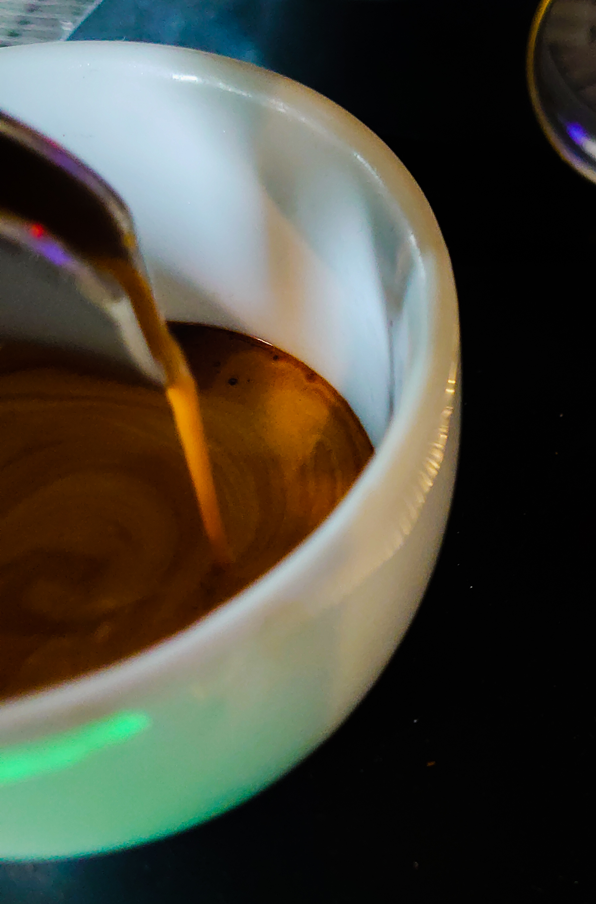
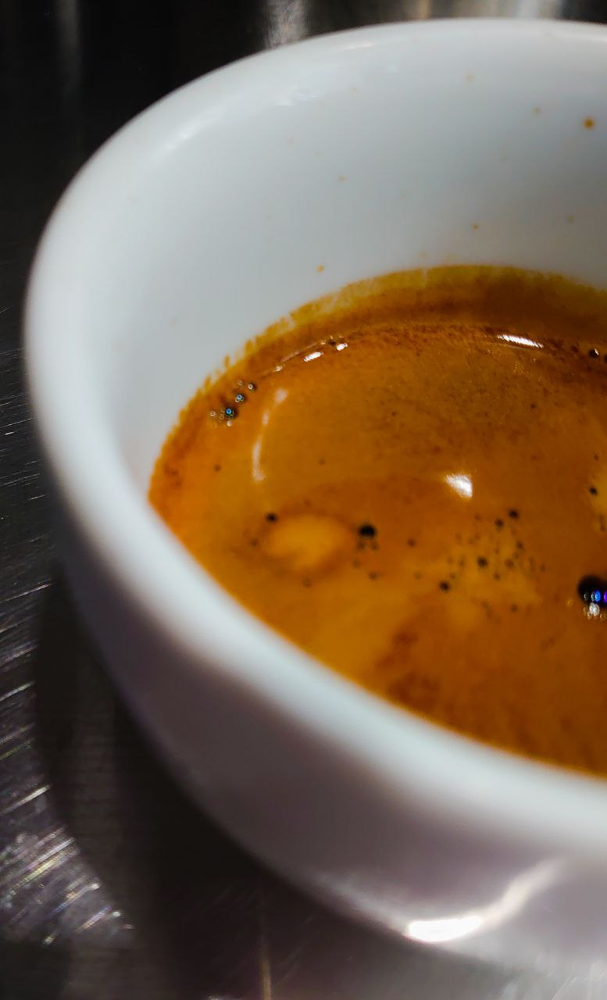
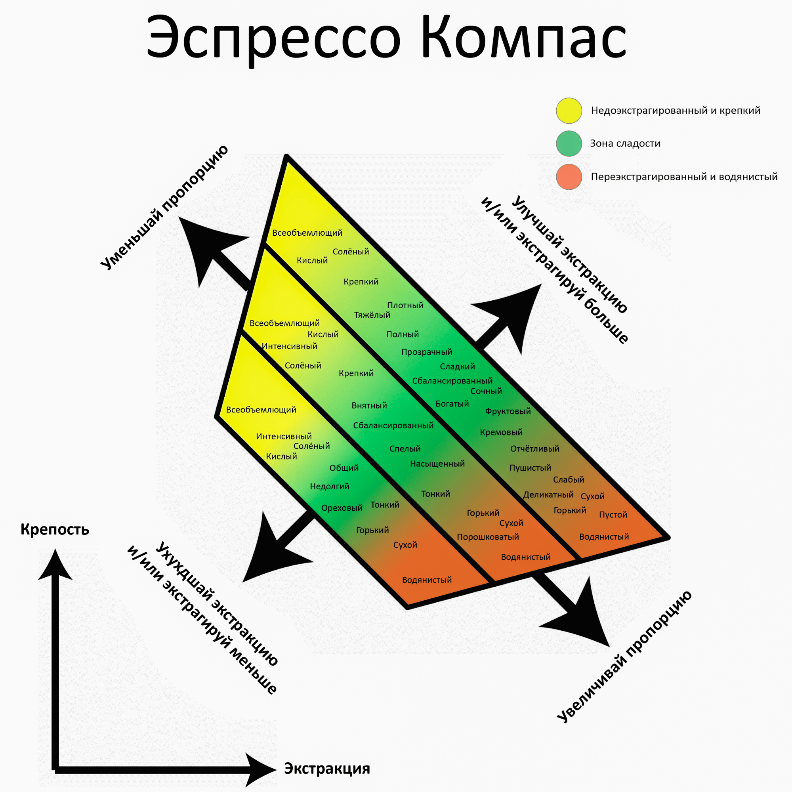

# Как быстро настроить вкусный эспрессо

[Часть 1](../012-ru-espresso-pt1/) · [Часть 2](../013-ru-espresso-pt2/) · Часть 3 · [Часть 4](../015-ru-espresso-pt4/)

Вкусный эспрессо бывает разным. Чашка на чемпионате и чашка в кофейне — это разные цели. Сначала решите, куда целитесь.

На вкус влияют техника, свежесть зерна, обжарка, вода, машина и даже температура в комнате. Задача не искать вечный идеал, а найти хороший вкус и уметь его повторить.

## Баланс, тело, букет

**Баланс** — как кислотность, сладость и горечь живут вместе. Равных долей никто не требует. В спешелти эспрессо часто смещён в кислотность и сладость. Из некоторых разновидностей, например [лаурины](../010-ru-varieties-of-coffee-pt2/), можно получить почти безгоречную чашку.

**Тело** — плотность и текстура на языке. Плотность и качество тела — разные вещи. Хороший эспрессо бывает шелковистым, округлым, кремовым.

**Букет** — ароматический профиль. Для быстрой настройки в смене он почти не нужен.

## Какой эспрессо считать вкусным

Каждый решает сам. Одна вкусная чашка — яркая кислотность, средняя сладость, мало горечи, лёгкое шелковистое тело. Другая — средняя кислотность, высокая сладость, средняя горечь, плотное обволакивающее тело.

## Быстрый рецепт

Сначала проверьте базовые вещи из [руководства по эспрессо](../013-ru-espresso-pt2/).

Удобный старт: коэффициент 1:2 за 25 секунд на 93 °C. Например, 18 г кофе → 36 г напитка.

Обжарку можно учесть сразу. Тёмная экстрагируется быстрее: температура 90–92 °C, выход около 1:1,8. Светлее средней — 94 °C и около 1:2,2.

Два шага. Сначала ловите кислотность и горечь выходом. Затем крутите экстракцию, пока не найдёте максимум сладости.

Это компас Мэтта Пергера. Вкусный эспрессо обычно в центре.

| Слишком горько или водянисто | Кислотность орёт |
| --- | --- |
| уменьшить выход, но не ниже 1:1,5 | увеличить выход, но не выше 1:2,5 |

Дальше — экстракция, как в заметке про [TDS](../019-ru-TDS/):

| Мало сладости, трава во вкусе | Таблеточная горечь, плохое тело |
| --- | --- |
| поднять температуру, не выше 95 °C | снизить температуру, не ниже 88 °C |
| удлинить пролив, не больше 30 секунд | укоротить пролив, не меньше 23 секунд |

Если оборудование чистое, зерно одно и рецепт один, базовые цифры почти всегда дают нормальную повторяемую чашку. Гнаться за идеалом нужно на чемпионате. В обычной жизни важнее стабильно готовить хороший кофе.
