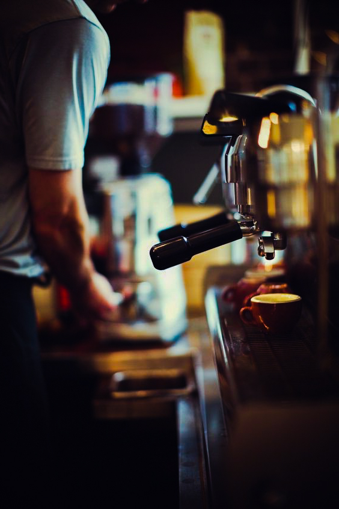
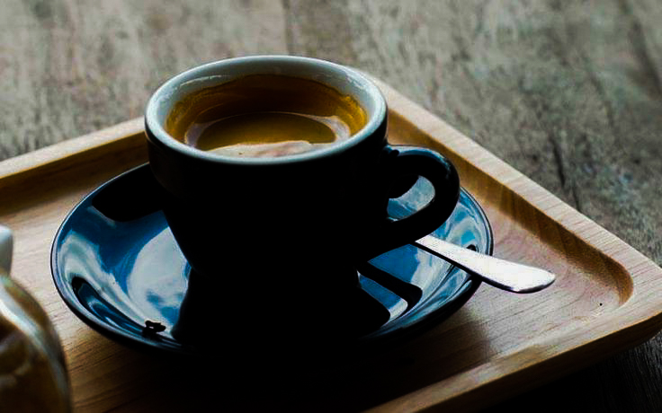
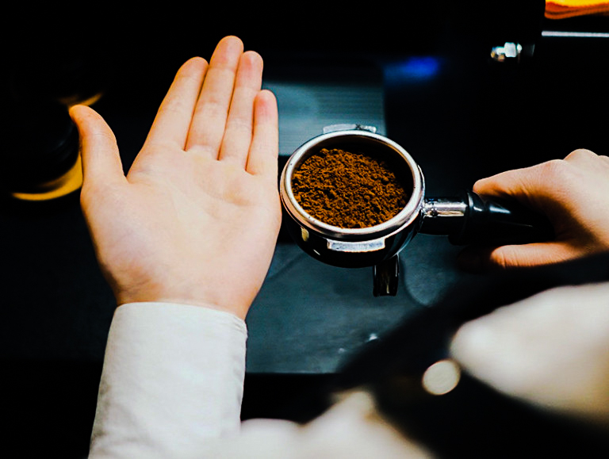
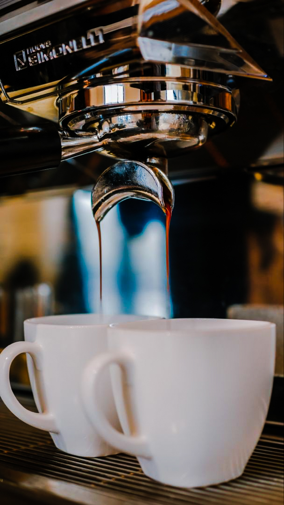

<!-- date: 2024-06-16 -->
# Как быстро изменить экстракцию при приготовлении эспрессо

[<a href="../012-ru-espresso-pt1/">Часть 1</a>
| <a href="../013-ru-espresso-pt2/">Часть 2</a>
| <a href="../014-ru-espresso-pt3/"> Часть 3</a>
| Часть 4]

[<a href="../015-ua-espresso-pt4/">UA</a>/RU]

## **Как быстро изменить экстркцию при приготовлении эспрессо**

Перед сменой бариста настраивает эспрессо. Для этого у него есть рецепт: вес молотого кофе, вес эспрессо, время пролива. Но что делать, если он попал в показатели, а со вкусом все равно что-то не так?

### **Как уровень экстракции влияет на вкус эспрессо**

*Несбалансированный эспрессо? Определите уровень экстракции*

Если эспрессо несбалансированный, необходимо определить уровень экстракции — это поможет понять, чем вызван неприятный вкус: переэкстракцией или недоэкстракцией. Уровнем экстракции можно управлять несколькими способами: изменением веса молотого кофе, изменением веса эспрессо, изменением времени экстракции или изменением температуры.

Определить переэкстракцию или недоэкстракцию можно либо с помощью [рефрактометра](../019-ru-TDS/), либо на вкус. При переэкстракции кофе имеет повышенную горечь, сухость, низкую кислотность. При недостаточной экстракции вкус будет травянистым, с некачественной кислотностью и низкой сладостью.

### **Как увеличить экстракцию эспрессо**

Дано: использовали оптимальное соотношение кофе и воды — 1:2. Из 18 грамм кофе приготовили 36 грамм эспрессо. Уровень экстракции — 18%.

Проблема: эспрессо получился с низкой сладостью, травянистым вкусом и резкой кислотностью, хотя он имеет целевой TDS — 10%.

Цель: получить более интенсивное тело и сладкую чашку. Для этого необходимо увеличить уровень экстракции.

Рекомендуем: уменьшить помол (или увеличить температуру воды) и уменьшить закладку кофе до 17,5 грамм. За счет этого уровень экстракции увеличивается до 20%.

Уменьшение массы молотого кофе дает более сбалансированную чашку из-за более высокой экстракции.

### **Как уменьшить экстракцию эспрессо**

Дано: из 18 грамм кофе приготовили 40 грамм эспрессо. Уровень экстракции — 22%.

Проблема: во вкусе эспрессо почувствовали сухость и горечь. При этом попали в целевой TDS — 9%.

Цель: избавиться от сухости, горечи и приготовить сбалансированную чашку. Для этого необходимо уменьшить уровень экстракции.

Рекомендуем: увеличить помол (или уменьшить температуру) и увеличить закладку кофе до 18,5 грамм. За счет этого уровень экстракции снизится до 20%.

*Почувствовали во вкусе эспрессо сухость и горечь? Попробуйте увеличить помол и количество кофе*

### **Как приготовить вкусный эспрессо еще быстрее**

В попытках изменить размер помола можно потратить слишком много кофе, прежде чем вы получите сбалансированную чашку. Поэтому есть другой вариант решения проблемы.

*Помните, что меньший выход веса эспрессо увеличивает TDS*

Если эспрессо незначительно переэкстрагирован — уменьшите выход эспрессо за счет прерывания экстракции, но не более чем на несколько грамм. Уровень экстракции уменьшится, но при этом увеличится TDS.
