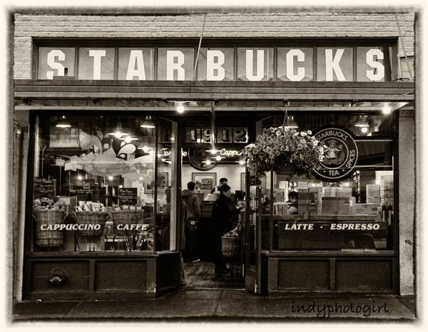
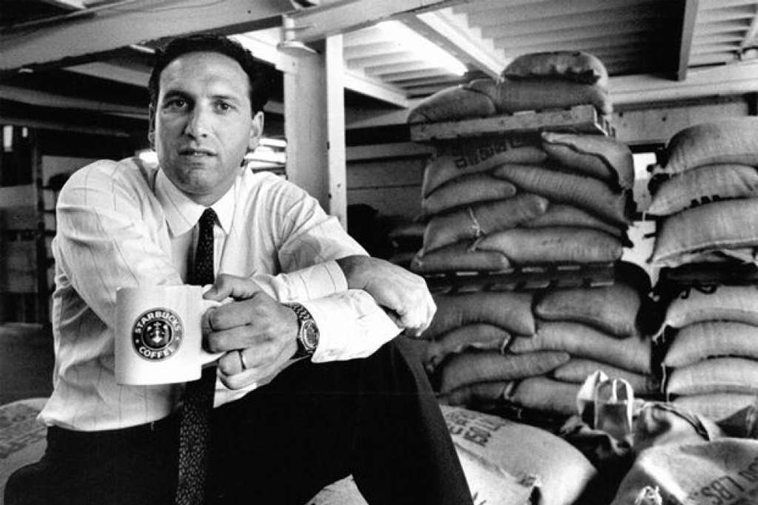
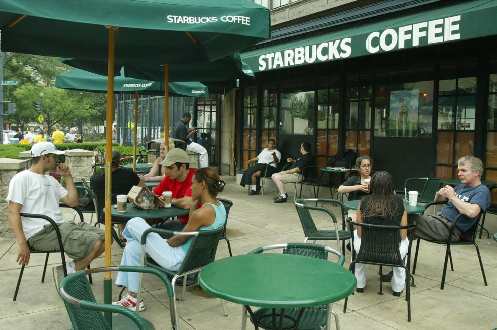
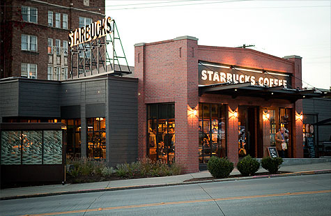
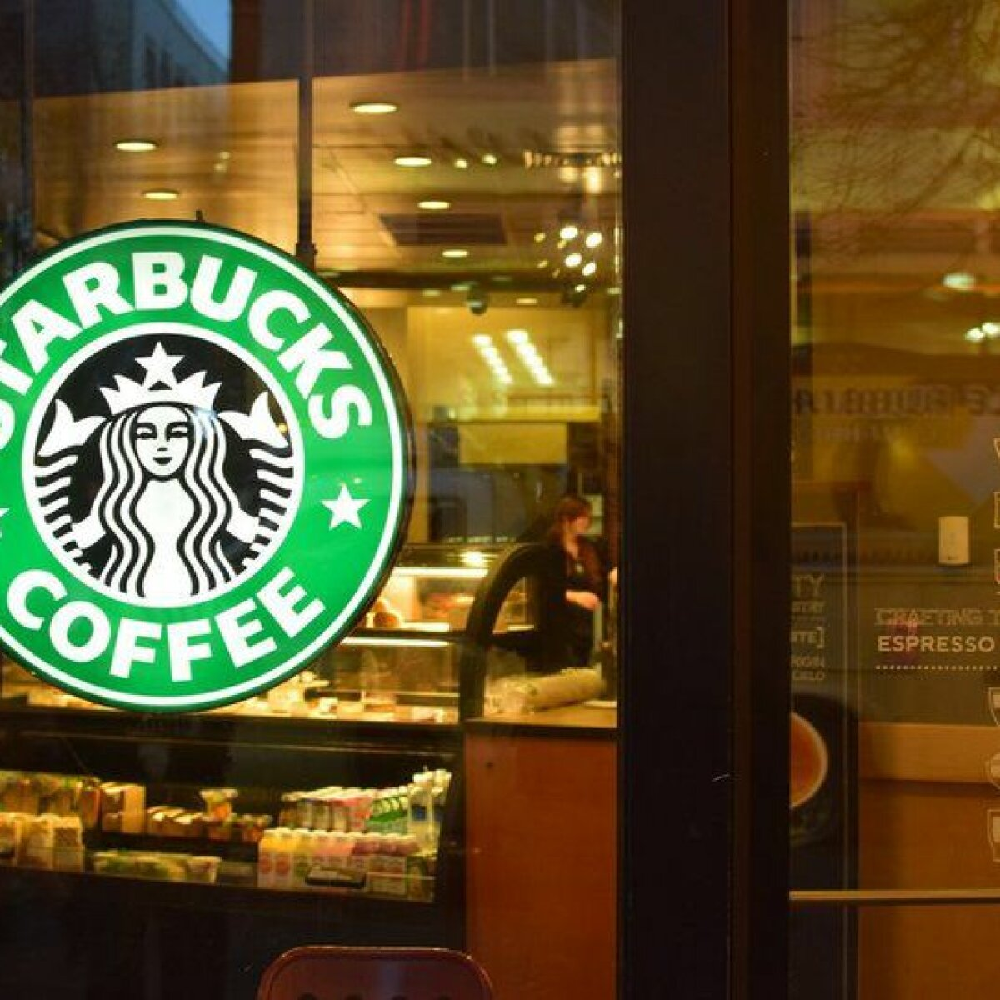

# История Starbucks

С 1971 года Starbucks прошла путь от маленького магазина в Сиэтле до одной из самых больших кофейных сетей в мире.

## Начало

*Первый Starbucks*

В 1971 году Джерри Болдуин, Зев Сигл и Гордон Боукер открыли магазин на рынке Пайк-плейс. Название и логотип взяли из «Моби Дика» и морской торговли кофе. Сначала продавали зерно и кофейное оборудование, а не напитки в стакане.

## Говард Шульц

*Говард Шульц*

В 1982 году Шульц пришёл директором по маркетингу. Поездка в Италию в 1983-м всё изменила: ему захотелось сети кофеен с эспрессо. В 1985-м он открыл Il Giornale, в 1987-м выкупил Starbucks за 3,8 млн долларов и переименовал свои кофейни.

## 1990-е: рост

*Starbucks в Японии*

В 1992 году компания вышла на биржу и получила деньги на расширение. В 1996-м открылась первая кофейня за пределами Северной Америки — в Токио. Так началась глобальная экспансия.

## 2000-е: кризис и возвращение

*Starbucks в 2003 году*

В 2000 году Шульц ушёл с поста гендиректора, но остался председателем совета. В 2008-м вернулся спасать компанию: закрыл слабые магазины, пересмотрел меню, запустил программу лояльности и расширил продукты.

## 2010-е: приложение и устойчивость

*Starbucks в 2010 году*

Появились мобильное приложение и оплата с телефона. Компания начала говорить об углеродном следе и поддержке фермеров.

## Сейчас

К 2020-м у сети больше 30 000 кофеен в 80 странах. Миссия звучит пафосно и при этом хорошо описывает масштаб: «вдохновлять человеческий дух — один человек, одна чашка, один район за раз».
