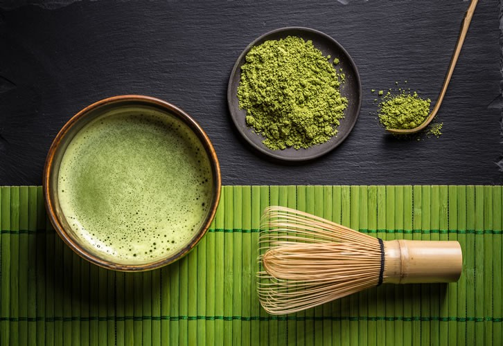
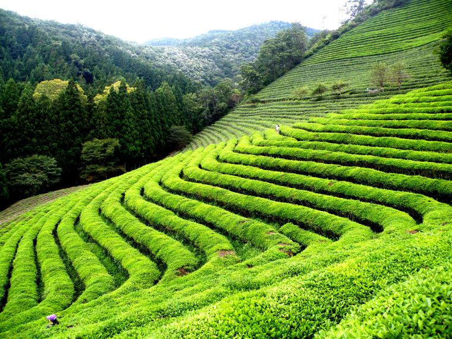
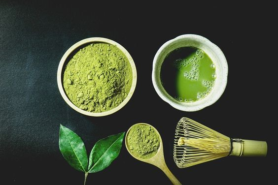

# Матча. Древний напиток в современном мире

Матча — японский зелёный чай в виде порошка. Её любят за вкус, кофеин без резкого спада и за то, как она выглядит в чашке и в десертах.

## Откуда она

Корни — в Китае, но своё место напиток нашёл в Японии. В XII веке монах Эйсай привёз чайные семена из Китая. Матча быстро вошла в жизнь самураев и буддийских монахов. Чайная церемония тядо (chadō) строится вокруг гармонии, уважения, чистоты и покоя.

## Как делают

За несколько недель до сбора кусты затеняют. В листьях становится больше хлорофилла и аминокислот. Затем листья обрабатывают паром, сушат и мелят на гранитных мельницах в ярко-зелёный порошок.

## Зачем её пьют

- Много катехинов, особенно EGCG — сильный антиоксидант.
- Кофеин вместе с L-теанином даёт ровную энергию и концентрацию, без типичного кофейного «обвала».
- Хлорофилл часто связывают с мягкой детокс-репутацией напитка.

## Сейчас

Матча давно вышла за церемонию. Из неё делают латте, смузи, коктейли, выпечку и десерты. Для многих это просто ещё один зелёный ритуал в ежедневном меню.

Это и культурное наследие, и удобный ингредиент. Можно пить её в чаван и венчиком — или в стакане с молоком. Оба варианта нормальные.
