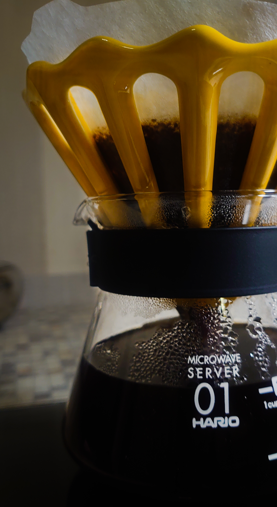
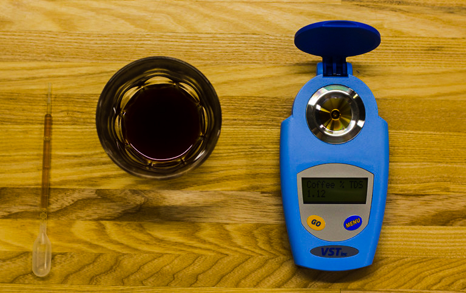
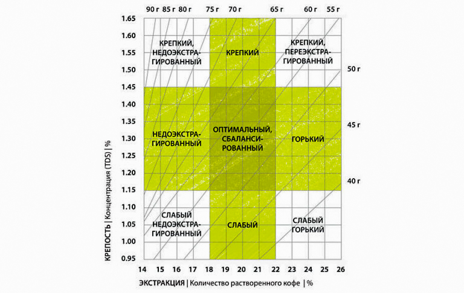
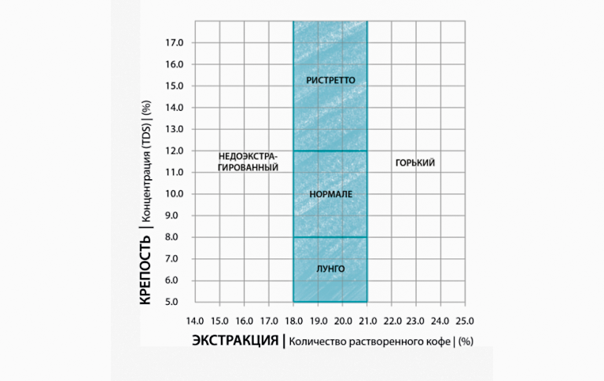

# Что такое TDS и уровень экстракции

*Украинский пуровер «Дотик»*

TDS — сколько растворённых частиц в готовом кофе. Проще: крепость чашки. Экстракция — какой процент веществ удалось вытащить из зерна.

## Экстракция

Около половины зерна — целлюлоза, она не растворяется. Растворимых веществ максимум около 36%, и то в лаборатории. При обычном заваривании выходит 14–26%. Сначала кислоты, потом сахара, в конце горечь.

Вкусная чашка — это баланс. Мало веществ — трава и жёсткая кислота. Много — таблеточная горечь. SCA считает удобным диапазон 18–22%. Ниже 18% — хлорогеновая кислотность и травянистая горечь. Выше 22% — кофеин, дубильные вещества, кислота пропадает.

## TDS

TDS — доля растворённых веществ от веса напитка. TDS 1,35% значит: 98,65% воды и 1,35% кофе. Чем выше цифра, тем насыщеннее кажется чашка.

По исследованиям SCA людям обычно нравится 1,15–1,45% TDS в фильтре.

## Как они связаны

Они часто движутся вместе, но не всегда.

Много кофе, короткое время или низкая температура: высокий TDS и низкая экстракция. Чашка крепкая, но недоэкстрагированная — трава и лишняя кислота.

Мало кофе, долгое время или слишком горячая вода: низкий TDS и высокая экстракция. Чашка водянистая и горькая, как таблетка.

TDS в первую очередь зависит от соотношения кофе и воды. Экстракция — от времени, температуры, помола и ещё нескольких вещей. Предпочтения по крепости разные: фильтр 1,15–1,45%, эспрессо 8–12%. Экстракция при этом всё равно целится в 18–22%.

Для фильтра удобный старт — 60 г кофе на 1 л воды. Для [эспрессо](../013-ru-espresso-pt2/) чаще 1:2, например 18 г кофе на 36 г напитка. Так TDS почти сам попадает в диапазон, остаётся поймать экстракцию.

## Как измерить

TDS меряют рефрактометром — по преломлению света.

Экстракцию считают после этого:

уровень экстракции (%) = вес напитка (г) × TDS (%) / вес молотого кофе (г)

Если в воронку влили 250 г воды, на выходе будет около 220 г: часть воды останется в кофе. 220 × 1,35 / 15 ≈ 19,8%.

SCA ещё нарисовала график: по горизонтали экстракция, по вертикали TDS. Пересечение показывает, куда уехала чашка.

У эспрессо шкала другая: TDS 8–12%.

Если у пуровера TDS 1,05%, экстракция выйдет около 15,4% — мало, вкус сырой. Сначала ловят TDS, потом аккуратно подтягивают экстракцию.

## Чем крутить TDS

1. Соотношение: больше кофе — выше TDS.
2. Помол: мельче — выше TDS.

## Чем крутить экстракцию

1. Время: дольше — выше.
2. Температура: горячее — выше.
3. Помол: мельче — выше.
4. Турбулентность: помешивание и порционные вливания тоже поднимают экстракцию.

Дальше идут обжарка, [вода](../020-ru-water/) и разновидность. Тёмное зерно экстрагируется быстрее. SL-28 и SL-34 из Кении тоже быстрые из-за сахаров и структуры клетки. Одна и та же воронка для Кении и Бразилии часто переэкстрагирует Кению.

## Что запомнить

Рефрактометр делает заваривание понятнее, но дома им почти никто не пользуется. Сначала попадите в соотношение кофе и воды — будет нормальный TDS. Дальше крутите вкус.
