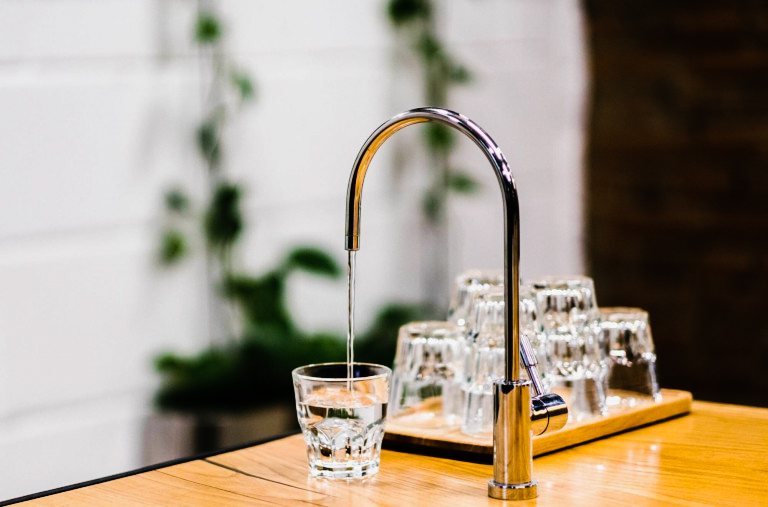
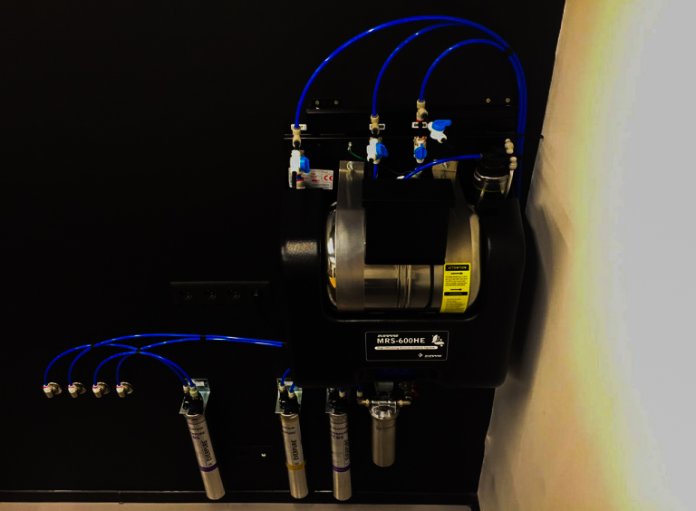

# Как выбрать воду для кофе

Вода растворяет ограниченное количество веществ за ограниченное время. Если она уже насыщена, кофе берёт мало. Если слишком пустая — берёт слишком много. На жёсткой воде чашка плоская, на слишком мягкой — кричаще яркая.

Ниже — ориентиры SCA.

## Какая вода нужна

Смотрят цвет, запах, минерализацию, хлор и pH.

1. Цвет и запах. Хорошая вода прозрачная и ничем не пахнет. Мутную воду с запахом не пьют и кофе на ней не варят.
2. Минерализация (TDS воды). Для кофе удобно 75–175 мг/л, цель — около 100 мг/л. Водопровод часто около 300 мг/л или, наоборот, ниже 50.

> Кальций лучше держать в районе 51–68 мг/л, натрий — около 10 мг/л.

3. Хлор. Его добавляют для дезинфекции, но он воняет и ломает вкус. Для кофе хлора должно быть ноль.
4. pH. Ниже — чашка кислее, выше — горче. Идеал около 7, нормально 6,5–8.

Водопровод обычно слишком жёсткий: вкус пустой, накипь убивает технику. Дистиллят слишком пустой: кофе выходит чрезмерно кислым.

Ориентир: прозрачная вода без запаха, 100–150 мг/л, без хлора, pH около семи.

## Как делают в кофейнях

Сначала осмос почти до дистиллята, потом подмешивают минерализованную воду. Так можно попасть в нужную цифру.

> MRS-600HE от Everpure — один из сильных профессиональных вариантов.

Для дома такие системы слишком большие и дорогие. Если вы не варите сотни чашек, смысла нет.

## Что делать дома

Кипячение не помогает: минералы выпадают в осадок, хлор становится хуже, вирусы не всегда гибнут. Остаются бытовой фильтр или бутылка.

Ищите фильтр со смягчающим и минерализующим модулями: сначала чистит, потом возвращает минералы. В долгую это дешевле бутылок, но без анализа воды точно не узнать, что выходит из крана. Водопровод везде разный, картридж один.

Бутилированную воду тоже надо выбирать. Можно просто попробовать несколько марок на одном зерне или отдать воду в лабораторию.

## Коротко

1. Вода важна так же, как зерно — неважно, марагоджип это или бразильский суль-де-минас.
2. Не слишком мягкая и не слишком жёсткая.
3. Водопровод, кипяток и дистиллят — плохие варианты.
4. Цель: прозрачная, без запаха, около 100 мг/л, без хлора, pH около 7.
5. Много кофе дома — бытовой фильтр. Мало — бутылка.
